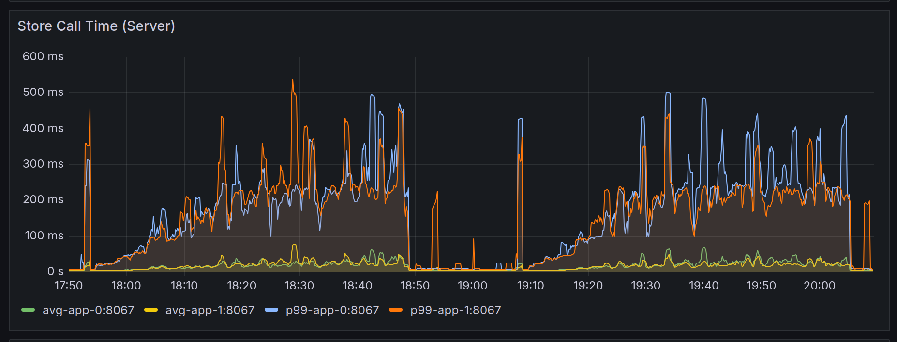
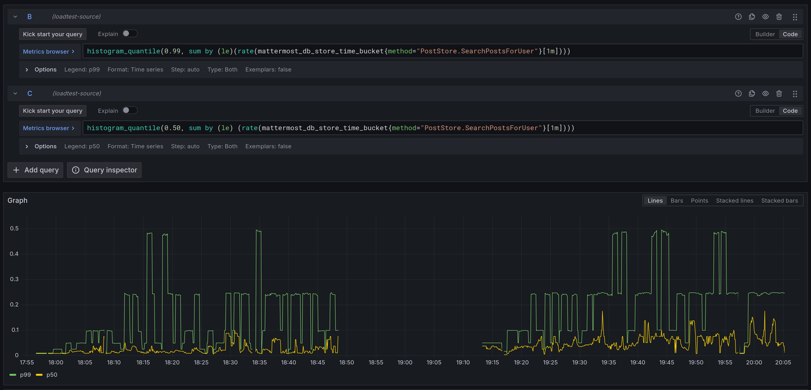

# CJK search analysis

This document analyzes the performance behaviour of a server configured to use `LIKE`-based queries when searching for CJK languages. The motivation behind the analysis is to try to simplify [the original tech spec to restore CJK search support in PostgreSQL](https://mattermost.atlassian.net/wiki/spaces/XYZ/pages/4243980292/Restoring+CJK+Search+Support+In+PostgreSQL), which proposed to use [the `pg_bigm` extension](https://github.com/pgbigm/pg_bigm), along with an index to improve the performance of such `LIKE`-based queries.

The question this document asks is: can we skip the `pg_bigm` and index requirement, and rely only on `LIKE`-based queries for search on a non-indexed `Posts` table?

The short answer is: yes, we can. The long answer is analyzed in detail in the rest of the document.

## Setup

The whole configuration can be found under the [config/](config/) directory. The following subsections highlight the important aspects of the setup used during these tests.

### Architecture

- Application: 2 `c7i.large` nodes (2 vCPUs, 4GiB RAM)
- Database: 2 `db.r7g.large` nodes (2 vCPUs, 16GiB RAM)

### Dataset

The dataset was based off the 12-million-post database dump. This dataset was pre-processed to:
1. Swap the message of all posts to a Japanese string, created by randomly picking characters from the Hiragana, Katakaga and Kanji Unicode blocks.
2. Reduce the count of the posts to 3.5 million posts.

### Mattermost version

The version of Mattermost used was the one built from [PR #35260](https://github.com/mattermost/mattermost/pull/35260), which introduced the LIKE-based queries on CJK searches.

### Load-test tool version

The tooling version was a custom build whose modifications were not merged upstream. It was built off [the `cjk.search` branch](https://github.com/mattermost/mattermost-load-test-ng/tree/cjk.search), which contains two modifications:
1. Addition of the feature flag to the systemd unit file, to control whether the CJK search is enabled or not.
2. Modification of the search behaviour, to always use Japanese characters when generating the random words.

### Methodology

We ran an unbounded comparison, running the same test twice, both with the exact same architecture, dataset and Mattermost version described above.

The only difference between the two tests were the value of the feature flag `CJKSearch`, which was controlled via an environment variable set in the systemd unit file, so that:
1. The first test had `Environment=MM_FEATUREFLAGS_CJKSEARCH=false`
2. The second test had `Environment=MM_FEATUREFLAGS_CJKSEARCH=true`

We were interested in the analysis of three main metrics:
1. The final number of supported users.
2. The overall store times, both the average and the p99 values.
3. The specific `PostStore.SearchPostsForUser` store times, both the average and the p99 values.

## Results

### Number of supported users

| CJKSearch = false | CJKSearch = true | Delta   |
|-------------------|------------------|---------|
| 7527              | 7438             | \-1.18% |

The number of supported users decreased a 1.18%, from 7527 to 7438, when enabling the feature flag. This difference sits in the \[-5%, +5%\] interval of usual variance, so there is no significant difference between the two tests.

### Store times

The following image shows the average and p99 values for the store times in both tests (`CJKSearch` set to false first, then set to true):



On visual inspection, both the average and the p99 seem similar. In order to get specific numbers, we can consider those metrics on a time window of 20 minutes, ending at the end of each test. The values are then:

|                   | Avg store time (ms) | p99 store time (ms) |
|-------------------|---------------------|---------------------|
| CJKSearch = false | 28.5                | 291                 |
| CJKSearch = true  | 26.1                | 243                 |

There is no significant difference in these values.

### `PostStore.SearchPostsForUser` times

The following image shows the p50 and p99 values for the `PostStore.SearchPostsForUser` times in both tests (`CJKSearch` set to false first, then set to true):



On visual inspection, both the p50 and p99 values seems slightly higher on the `CJKSearch=true` case. In order to get specific numbers, we can consider those metrics on a time window of 20 minutes, ending at the end of each test. The values are then:

|                   | SearchPostsForUser p50 (ms) | SearchPostsForUser p99 (ms) |
|-------------------|-----------------------------|-----------------------------|
| CJKSearch = false | 25.7                        | 248                         |
| CJKSearch = true  | 63.6                        | 402                         |

Here we see an increase in both values. The average time to search posts increases ~2.5 times for CJK searches, while the p99 value increases ~1.6 times for CJK searches. These increments are important, but an average value of 63ms and a p99 of 402ms is still well beyond the budget for these methods.

### Manual inspection

While the numerical analysis is important to quantify the performance, a manual inspection was also performed to understand whether the user experience had worsened. A sample of these tests can be seen in the following video:

[Manual test to validate UX](https://github.com/user-attachments/assets/3d8a22e1-19b9-4ac0-98e1-da160adca2ba)

This manual test was executed, as seen at the beginning of the video, when the server had ~6650 concurrent users, to validate the user experience with a lot of traffic in the server. Four searches are performed:
1. The full content of a post in Japanese, expecting to only find such post.
2. A gibberish string containing Japanese characters, expecting not to find any post.
3. A single character in Japanese, expecting to find many posts.
4. A single word in English, expecting to find posts with English words and to verify that the full-text search was still valid when not using CJK terms in the search query (note how the search finds `messaging` when we look for `message`).

All manual tests were successful, with the response times feeling natural to the user.

## Final notes

This analysis shows that the `LIKE`-based search queries on CJK languages are a more than reasonable option to pursue, with comparable latencies on search times and a general performance behaviour similar to the full-text search approach. This analysis is only valid for databases up to 3.5 million posts, with the general recommendation to use Elasticsearch after 2.5 million posts still standing. Elasticsearch offers a better search experience that is in turn more performant for larger databases.

As a fallback for servers using `LIKE`-based search queries that find their search performance not to be ideal, the analyzed solution still allows for a manual installation of `pg_bigm` and creation of GIN index, which will improve the search queries immediately after the index is created. With the setup and dataset described in this report, the concurrent creation of the index took around 15 minutes:

``` sql
cjkdb=> CREATE INDEX CONCURRENTLY pgbigm_posts_message_idx ON posts USING gin (message gin_bigm_ops);
CREATE INDEX
Time: 873544.754 ms (14:33.545)
```
