# Performance Comparison `v10.11.17` vs `v11.7.1`

## Comments

- A favorable performance comparison across a major-version ESR jump, from `v10.11.17` to `v11.7.1`:
    - The unbounded test shows a +5.37% increase in the number of supported users (from 16392 to 17273). This slightly exceeds the \[-5%, +5%\] interval of usual variance, but in the positive direction: the new version supports more concurrent users.
    - The bounded test shows no systemic regression in throughput. 
    - `login` (avg 70ms -> 104ms, p99 354ms -> 496ms) and the user write path (`createUser` avg +24.87%, `UserStore.Save` avg +57.11%) show moderate increases, possibly because of the new hashing algorithm (PBKDF2) introduced in v11.0.
- Meta-notes:
    - This is the first time we run an ESR-to-ESR test.
    - Why "almost"? The load-test tool has some guardrails on server versions, with some checks here and there to change the behaviour based on the server that is being currently tested. This pattern is not thorough, though, and one of the places where this is currently broken is in `UserEntity.GetClientConfig`. The underlying client method changed on v11.0.0, and it was not backwards-compatible with previous versions. [The fix](https://github.com/mattermost/mattermost-load-test-ng/commit/df286de59beb9fcfb8a84f7e91ca2f62bc13bd44) was simple: if the version is lower than v11.0.0, use the older path. This, however, points to potential unknown problems related to behaviour that has changed from v10.11 to v11.7 but that we're stressing in the same new way in both runs.

## Action Items

- Merge the `GetClientConfig` change upstream.
- Review potential overlooked behaviour changes.

## Setup

| Setting                            | Value                                                                                                                                                                                                                                                                                              |
|------------------------------------|----------------------------------------------------------------------------------------------------------------------------------------------------------------------------------------------------------------------------------------------------------------------------------------------------|
| Load-test version                  | Built from the [`esr.fix`](https://github.com/mattermost/mattermost-load-test-ng/tree/esr.fix) branch, commit [`df286de5`](https://github.com/mattermost/mattermost-load-test-ng/commit/df286de59beb9fcfb8a84f7e91ca2f62bc13bd44) ("Branch /config/client requests on server version", 2026-06-04) |
| Dataset                            | [Dump from `v6.1.0`, 12M posts](https://lt-public-data.s3.amazonaws.com/12M_610_fixed_psql.sql.gz)                                                                                                                                                                                                 |
| Bounded - number of users          | 6500                                                                                                                                                                                                                                                                                               |
| Bounded - duration                 | 90 minutes                                                                                                                                                                                                                                                                                         |
| Unbounded - MaxActiveUsers         | 20000                                                                                                                                                                                                                                                                                              |
| Unbounded - num of users per agent | 2000                                                                                                                                                                                                                                                                                               |
| App instances                      | 2 x c7i.2xlarge                                                                                                                                                                                                                                                                                    |
| Agent instances                    | 11 x c7i.xlarge                                                                                                                                                                                                                                                                                    |
| Proxy Instance                     | 1 x c7i.xlarge                                                                                                                                                                                                                                                                                     |
| DB instances                       | 2 x db.r7g.2xlarge                                                                                                                                                                                                                                                                                 |

## Results

### Grafana

These are snapshots of the original Grafana dashboards.

- [Bounded test](https://snapshots.raintank.io/dashboard/snapshot/oGixbURKbt73E05WTLosjQlHNUGKUw0X)
- [Unbounded test](https://snapshots.raintank.io/dashboard/snapshot/RvRXsM0EqvR2njKDnxEtF7IzolcFdA7w)

### Supported users in unbounded test

| v10.11.17 | v11.7.1 | Delta   |
| --------- | ------- | ------- |
| 16392     | 17273   | +5.37%  |

### Graphs - Bounded

| 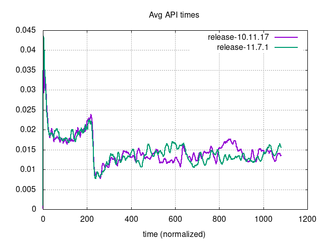     | 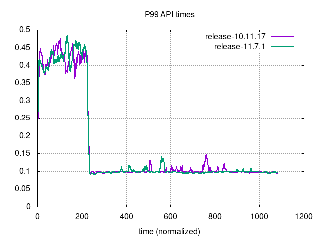                             |
|------------------------------------------------------------------------------------------|------------------------------------------------------------------------------------------------------------------|
| 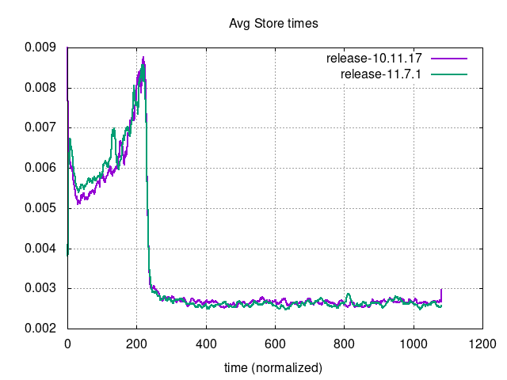 | 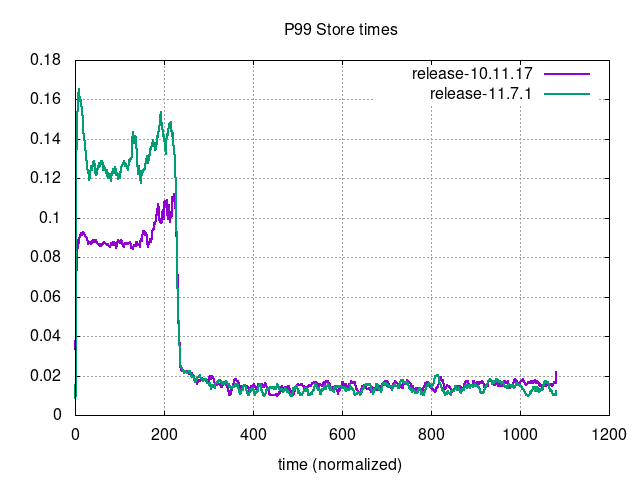                         |
| 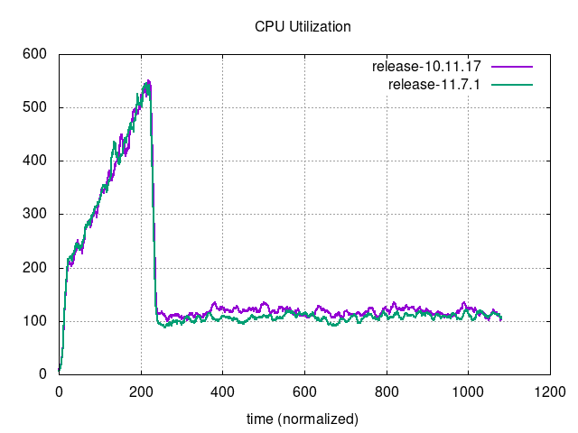 | 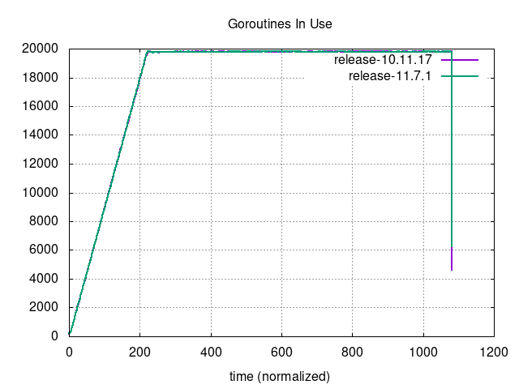                     |
| 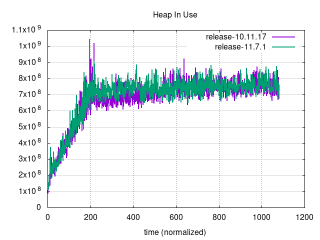         | 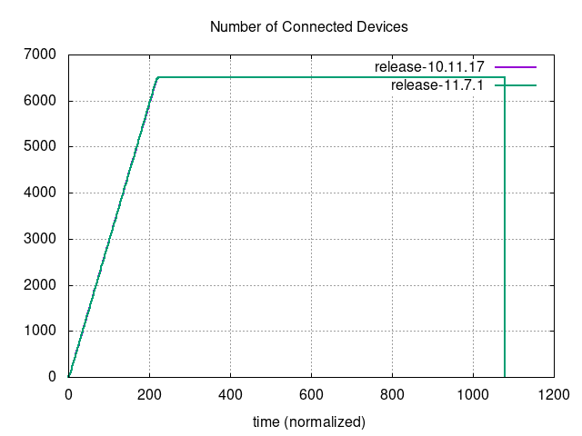 |
| 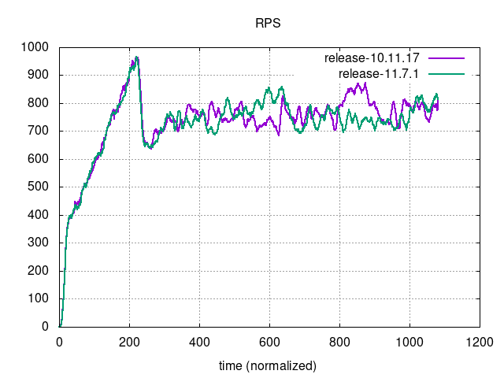                         | 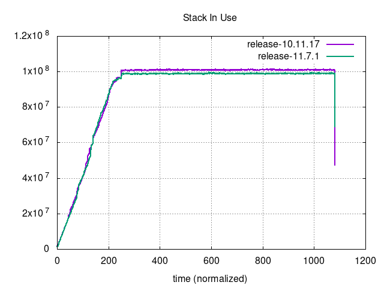                               |

### Graphs - Unbounded

| 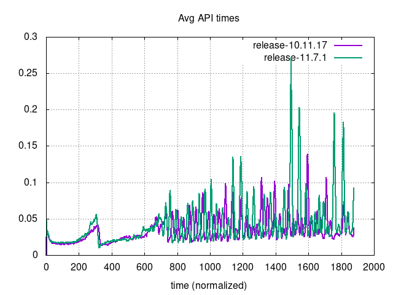     | 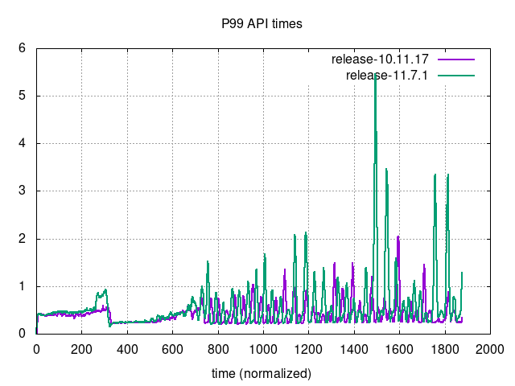                             |
|----------------------------------------------------------------------------------------------|----------------------------------------------------------------------------------------------------------------------|
| 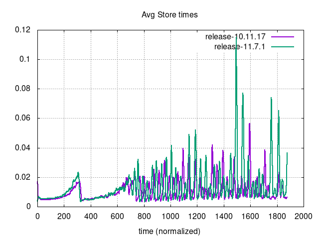 | 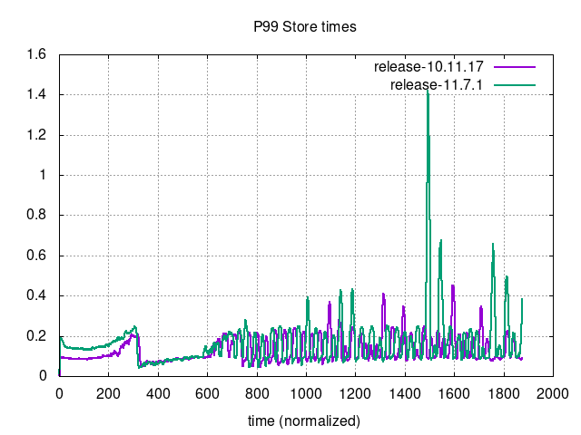                         |
| 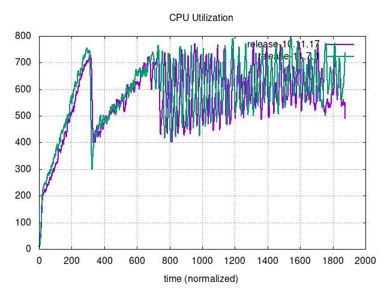 | 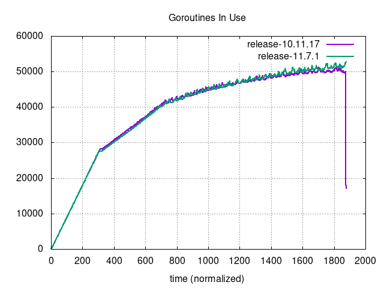                     |
| 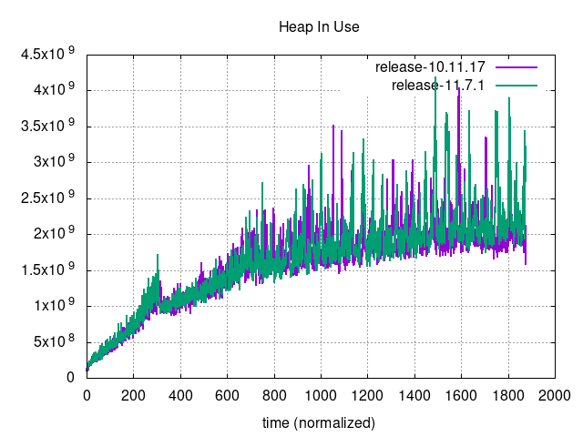         | 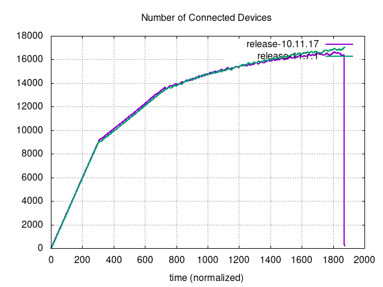 |
| 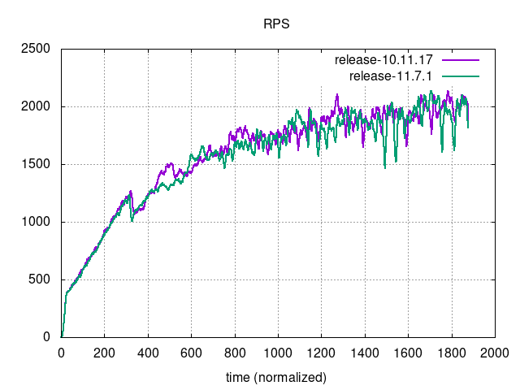                         | 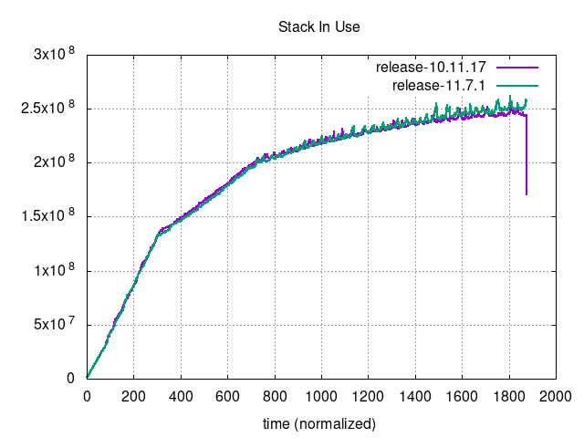                               |
