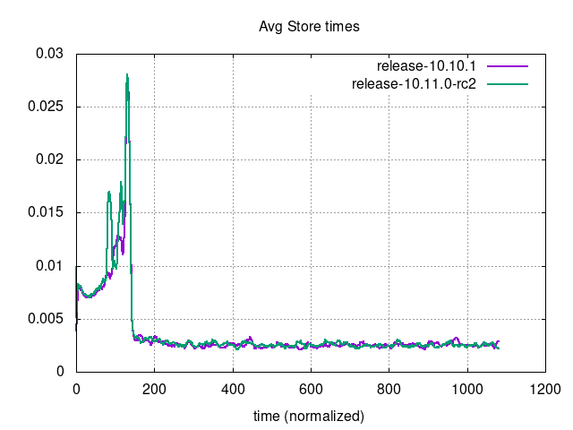

# Performance Comparison `v10.10.1` vs `v10.11.0-rc2`

## Comments

- Unbounded tests show no significant difference: number of supported users is larger in v10.11.0-RC2 than in v10.10.1 for both Postgres (+0.67%) and MySQL (+2.17%). Both of these fall into the \[-5%, +5%\] interval of difference considered normal.
- Bounded tests show no significant difference in any of the metrics considered.
- Manual testing showed [a noticeable delay pulling in the post author's name in the first load of channels](https://community.mattermost.com/core/pl/i8s75drjs3b3xp87iak5dsx4oy), but there was no difference between versions, so this does not affect the release process of v10.11. This issue may point to a gap in the coordinator metrics thresholds, that do not take into account this kind of UX. [A ticket](https://mattermost.atlassian.net/browse/MM-64982) was created to track this.

## Action Items

- Release can continue as planned.
- No other action needed.

## Setup

| Setting                              | Value                                                                                                                                                                                      |
| ------------------------------------ | ------------------------------------------------------------------------------------------------------------------------------------------------------------------------------------------ |
| Load-test version                    | [`v1.28.0`](https://github.com/mattermost/mattermost-load-test-ng/releases/tag/v1.28.0)                                                                                                    |
| Dataset                              | Dump from `v6.1.0`, 12M posts ([postgres](https://lt-public-data.s3.amazonaws.com/12M_610_fixed_psql.sql.gz), [mysql](https://lt-public-data.s3.amazonaws.com/12M_610_fixed_mysql.sql.gz)) |
| Bounded - number of users (Postgres) | 7500                                                                                                                                                                                       |
| Bounded - number of users (MySQL)    | 5000                                                                                                                                                                                       |
| Bounded - duration                   | 90 minutes                                                                                                                                                                                 |
| Unbounded - MaxActiveUsers           | 20000                                                                                                                                                                                      |
| Unbounded - num of users per agent   | 2000                                                                                                                                                                                       |
| App instances                        | 2 x c7i.2xlarge                                                                                                                                                                            |
| Agent instances                      | 11 x c7i.xlarge                                                                                                                                                                            |
| Proxy Instance                       | 1 x c7i.xlarge                                                                                                                                                                             |
| DB instances                         | 2 x db.r7g.2xlarge                                                                                                                                                                         |

## Results

### Grafana

These are snapshots of the original Grafana dashboards.

- [Bounded - MySQL](https://snapshots.raintank.io/dashboard/snapshot/SuuvQnlaw6BvgmXbJiri3Zvxv0MMxVBm)
- [Bounded - Postgres](https://snapshots.raintank.io/dashboard/snapshot/xgwwsITvqN9EGY96TyaFnwO5UWCO2elK)
- [Unbounded - MySQL](https://snapshots.raintank.io/dashboard/snapshot/6nmgaoH2am7Z7eBM17gg1vlglr53suT6)
- [Unbounded - Postgres](https://snapshots.raintank.io/dashboard/snapshot/uIZApy1VdD11prjDjhVGhQ8XlcLGMB28)

### Supported users in unbounded tests

| Test     | v10.10.1 | v10.11.0-rc2 | Delta |
| -------- | -------- | ------------ | ----- |
| MySQL    | 15607    | 15946        | 2.17% |
| Postgres | 16177    | 16286        | 0.67% |
| Delta    | 3.65%    | 2.13%        |       |

### Graphs - Bounded MySQL

|  |  |
| --- | ---|
|  |  |
|  |  |
|  |  |
|  |  |

### Graphs - Bounded Postgres

|  |  |
| --- | ---|
|  |  |
|  |  |
|  |  |
|  |  |

### Graphs - Unbounded MySQL

|      |                              |
| --- | --- |
|  |                          |
|  |                      |
|          |  |
|                          |                                |

### Graphs - Unbounded Postgres

|      |                              |
| --- | ---|
|  |                          |
|  |                      |
|          |  |
|                          |                                |
                                                                                                                                                                                                 |                                                                                                                                                                                                                         |
                                                                                                                                                                                                               |                                                                                                                                                                                                                                       |
