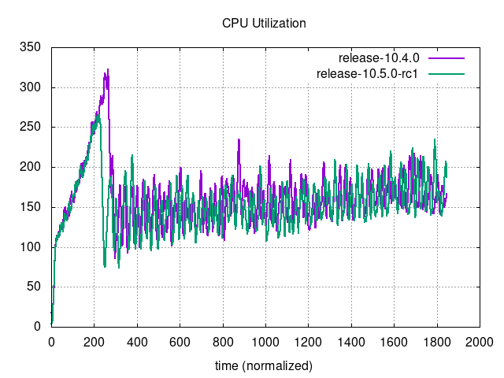
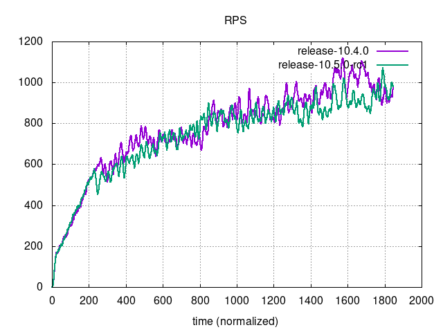
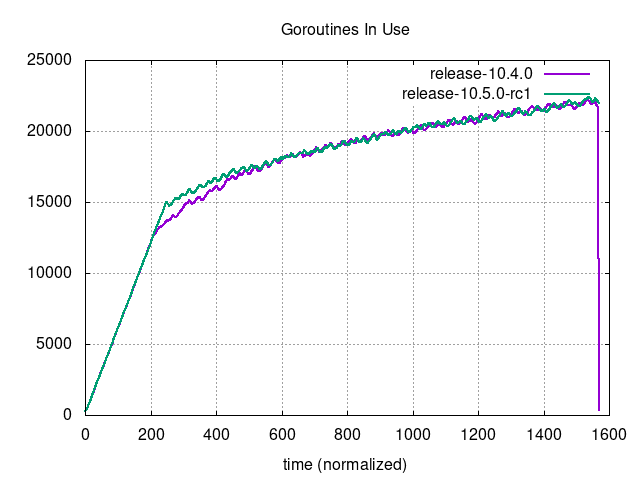

# Performance Comparison `v10.4.0` vs `v10.5.0-rc1`

## Comments

- The database dump used during the tests has been slightly modified for this comparison: after [an investigation on an issue with file thumbnails](https://mattermost.atlassian.net/browse/MM-62653), it was decided to remove the posts with orphaned attachments, since there was no matching S3 bucket with the corresponding data for those. This helped reduce the wobbliness at the beginning of the tests, which was caused by the high number of 500 errors received due to the lack of attachments.
- The results of the tests are expected and don't show any signs of performance regressions:
  - Bounded tests metrics don't show any significant difference.
  - The differences in number of supported users in unbounded tests are not significant either, both being slightly favorable to the new version: +2.89% for MySQL, +2.59% for Postgres.
- The results in the unbounded tests are consistent with the latest performance comparison, where MySQL numbers were better than Postgres for the first time in the history of these comparisons: this time, the number of supported users for MySQL is a 9.6% better for 10.4.0, and a 9.9% better for 10.5.0-RC1.

## Action Items

- Release can continue as planned.
- No other immediate action needed.
- A ticket was created to investigate why MySQL seems to behave better than Postgres now: [MM-62912](https://mattermost.atlassian.net/browse/MM-62912).

## Setup

| Setting                              | Value                                                                                                                                                                                      |
| ------------------------------------ | ------------------------------------------------------------------------------------------------------------------------------------------------------------------------------------------ |
| Load-test version                    | [`v1.24.0`](https://github.com/mattermost/mattermost-load-test-ng/releases/tag/v1.24.0)                                                                                                    |
| Dataset                              | Dump from `v6.1.0`, 12M posts ([postgres](https://lt-public-data.s3.amazonaws.com/12M_610_fixed_psql.sql.gz), [mysql](https://lt-public-data.s3.amazonaws.com/12M_610_fixed_mysql.sql.gz)) |
| Bounded - number of users (Postgres) | 7500                                                                                                                                                                                       |
| Bounded - number of users (MySQL)    | 5000                                                                                                                                                                                       |
| Bounded - duration                   | 90 minutes                                                                                                                                                                                 |
| Unbounded - MaxActiveUsers           | 20000                                                                                                                                                                                      |
| Unbounded - num of users per agent   | 2000                                                                                                                                                                                       |
| App instances                        | 2 x c7i.2xlarge                                                                                                                                                                            |
| Agent instances                      | 11 x c7i.xlarge                                                                                                                                                                            |
| Proxy Instance                       | 1 x c7i.xlarge                                                                                                                                                                             |
| DB instances                         | 2 x db.r7g.2xlarge                                                                                                                                                                         |

## Results

### Grafana

These are snapshots of the original Grafana dashboards.

- [Bounded - MySQL](https://snapshots.raintank.io/dashboard/snapshot/F8Z0v0n7EuE5UGPAwpj0JFRY61ITQqxz)
- [Bounded - Postgres](https://snapshots.raintank.io/dashboard/snapshot/JsnPZxCAroOPzokqcRFNaAxBz1zkkBzl)
- [Unbounded - MySQL](https://snapshots.raintank.io/dashboard/snapshot/LzesHwfTiUJZgwHXGQLrH0HhvMg4M4yb)
- [Unbounded - Postgres](https://snapshots.raintank.io/dashboard/snapshot/dhoAFTKhJbThOsyeLB8cXSeJKmUYq8Po)

### Supported users in unbounded tests

| Test     | v10.4.0 | v10.5.0-rc1 | Delta |
| -------- | ------- | ----------- | ----- |
| MySQL    | 7746    | 7970        | 2.89% |
| Postgres | 7064    | 7247        | 2.59% |

### Graphs - Bounded MySQL

|  |  |
| --- | ---|
|  |  |
|  |  |
|  |  |
|  |  |

### Graphs - Bounded Postgres

|  |  |
| --- | ---|
|  |  |
|  |  |
|  |  |
|  |  |

### Graphs - Unbounded MySQL

|      |                              |
| --- | --- |
|  |                          |
|  |                      |
|          |  |
|                          |                                |

### Graphs - Unbounded Postgres

|      |                              |
| --- | ---|
|  |                          |
|  |                      |
|          |  |
|                          |                                |
