# Performance Comparison `v10.5.0` vs `v10.6.0-rc3`

## Comments

- This performance comparison had to be executed three times, one for each release candidate of v10.6.0:
  - [The comparison for RC1](https://community.mattermost.com/core/pl/ty6kgybndi8adme8558b9g9q1o) showed clear symptoms of a problem, the most prominent being that the app nodes suddenly stopped, with not apparent reason (see screenshot below). [The first theory](https://community.mattermost.com/core/pl/96pb4ytog38dmrbbi38jgna1ro) was that [a fix in the webhub](https://github.com/mattermost/mattermost/pull/30224) was not present in RC1, and was causing the issues, so we decided to repeat the comparison with RC2.
  - [The comparison for RC2](https://community.mattermost.com/core/pl/4rb6bx3ddbd5jyicsom1wpkgpo) showed the exact same symptoms, and after [a lengthy investigation](https://community.mattermost.com/core/pl/6wxmjeykdbd9zfo8ggrxdqcrgr), we found out [the real bug](https://mattermost.atlassian.net/browse/MM-63304), which was causing random crashes in the server.
  - That bug was fixed and released on RC3, and this report covers the results of that comparison.

- The results of this comparison are nonetheless surprising, specially regarding unbounded tests:
  - The reported number of supported users in `v10.6.0-RC3` with respect to `v10.5.0` is a 16.86% higher for MySQL and a 15.70% higher for Postgres.
  - Looking closely at the graphs, it seems that `v10.6.0-RC3` starts hitting the coordinator metrics slightly before `v10.5.0`, but the growth of users is more steady, so the coordinator stops the test way after, thus reporting a larger number of supported users. See screenshots below.
  - The number of supported users are back to what we were used to, with Postgres being slightly more performant than MySQL: a difference of 1.52% for the base build and a difference of 0.51% for the new build.

- Metrics considered in the bounded tests do not show any significant difference.
- CPU profiles do not show large differences either. The only one showing a large difference is MySQL bounded: the whole tree under `app.(*Server).Start.(*Cors).Handler.func3` is removed/added in the new build because the root got renamed to `app.(*Server).Start.(*Cors).Handler.func4` (see screenshot below). The cause is still unknown, and it's not clear why it only happened on MySQL bounded. See the diffs of the CPU profiles, with the entire test considered for unbounded tests, and only the stable part considered for bounded tests:
  - [Postgres unbounded](https://flamegraph.com/share/5ec3609e-fdd4-11ef-8d53-2a7e77e4af82)
  - [MySQL unbounded](https://flamegraph.com/share/6338f87b-fdd4-11ef-8d53-2a7e77e4af82)
  - [Postgres bounded](https://flamegraph.com/share/67a051ef-fdd4-11ef-8d53-2a7e77e4af82)
  - [MySQL bounded](https://flamegraph.com/share/6e7ccb27-fdd4-11ef-8d53-2a7e77e4af82)

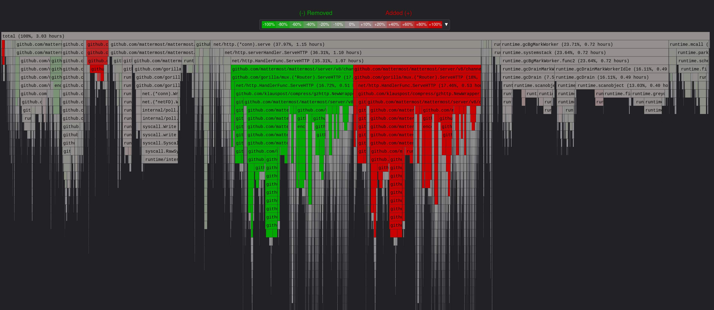

## Action Items

- Discuss the increase in number of supported users
- Discuss the difference in the CPU profile for MySQL bounded

## Setup

| Setting                              | Value                                                                                                                                                                                      |
| ------------------------------------ | ------------------------------------------------------------------------------------------------------------------------------------------------------------------------------------------ |
| Load-test version                    | [`v1.25.0`](https://github.com/mattermost/mattermost-load-test-ng/releases/tag/v1.25.0)                                                                                                    |
| Dataset                              | Dump from `v6.1.0`, 12M posts ([postgres](https://lt-public-data.s3.amazonaws.com/12M_610_fixed_psql.sql.gz), [mysql](https://lt-public-data.s3.amazonaws.com/12M_610_fixed_mysql.sql.gz)) |
| Bounded - number of users (Postgres) | 7500                                                                                                                                                                                       |
| Bounded - number of users (MySQL)    | 5000                                                                                                                                                                                       |
| Bounded - duration                   | 90 minutes                                                                                                                                                                                 |
| Unbounded - MaxActiveUsers           | 20000                                                                                                                                                                                      |
| Unbounded - num of users per agent   | 2000                                                                                                                                                                                       |
| App instances                        | 2 x c7i.2xlarge                                                                                                                                                                            |
| Agent instances                      | 11 x c7i.xlarge                                                                                                                                                                            |
| Proxy Instance                       | 1 x c7i.xlarge                                                                                                                                                                             |
| DB instances                         | 2 x db.r7g.2xlarge                                                                                                                                                                         |

## Results

### Grafana

These are snapshots of the original Grafana dashboards.

- [Bounded - MySQL](https://snapshots.raintank.io/dashboard/snapshot/dQa7igswhi9Ohx1pVAOlQcoH3n5ABLYa)
- [Bounded - Postgres](https://snapshots.raintank.io/dashboard/snapshot/caW05CibLAr6WuTQQ7yl5NjUeL1CPF7m)
- [Unbounded - MySQL](https://snapshots.raintank.io/dashboard/snapshot/pJezsAGu95c81VbxaNUw2a2T9Pj9P0ew)
- [Unbounded - Postgres](https://snapshots.raintank.io/dashboard/snapshot/9p9ZLK9FtSfFbXZVF5Ymii5IXCKobQGz)

### Supported users in unbounded tests

| Test     | v10.5.0 | v10.6.0-rc3 | Delta  |
| -------- | ------- | ----------- | ------ |
| MySQL    | 8552    | 9994        | 16.86% |
| Postgres | 8682    | 10045       | 15.70% |

### Graphs - Bounded MySQL

|  | 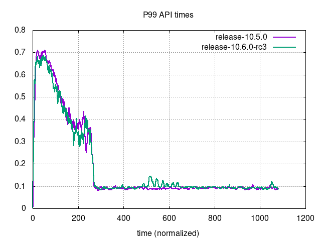 |
| --- | ---|
| 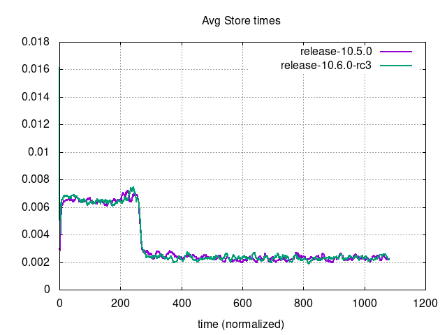 | 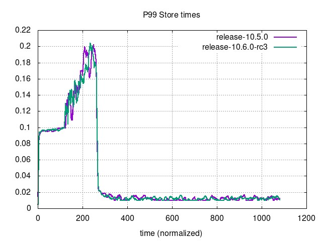 |
| 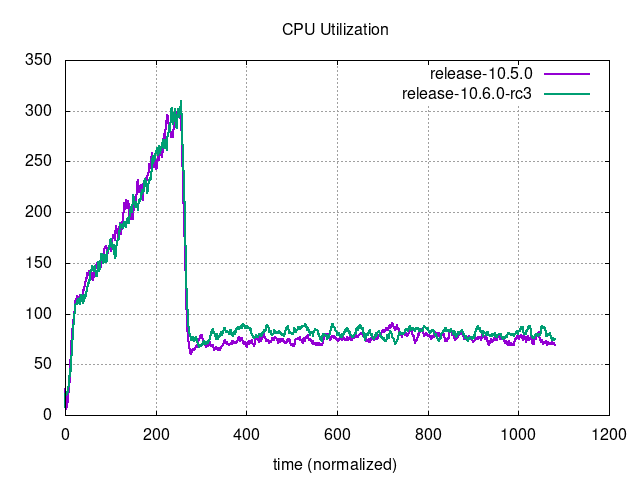 |  |
| 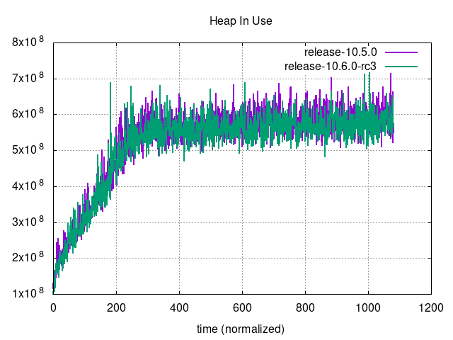 |  |
| 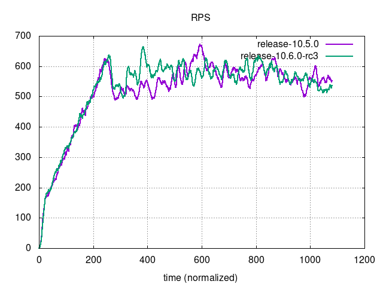 |  |

### Graphs - Bounded Postgres

| 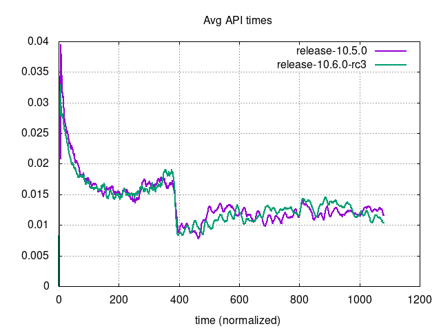 | 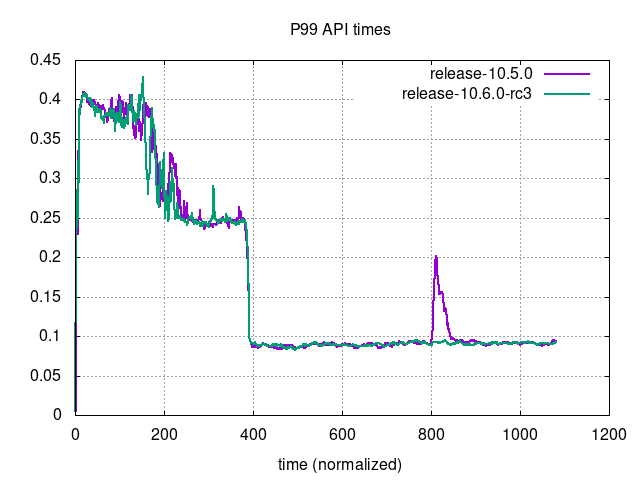 |
| --- | ---|
| 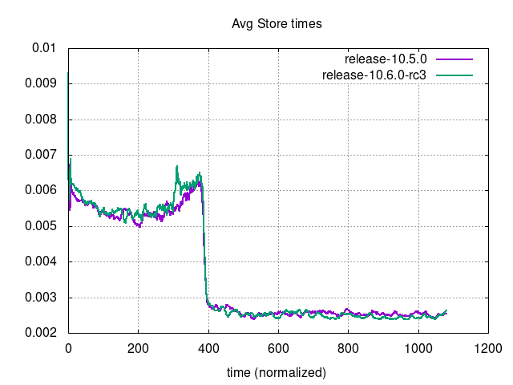 | 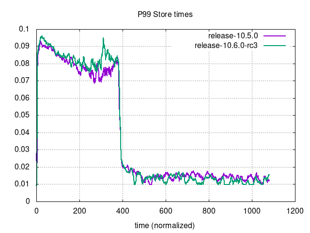 |
| 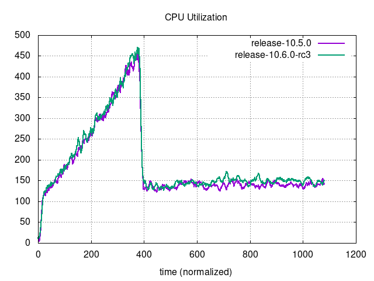 |  |
|  | 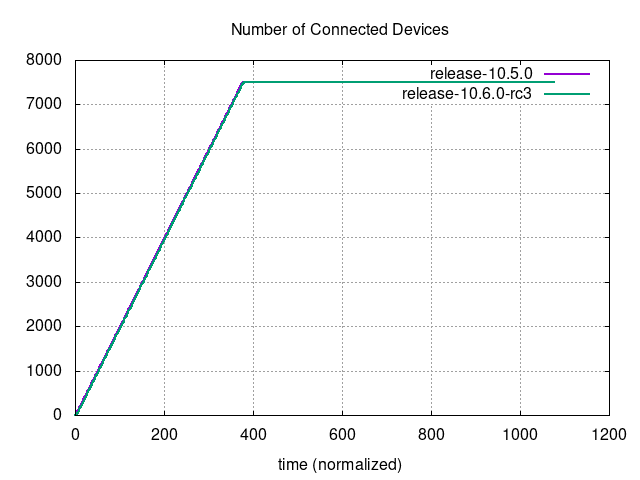 |
|  |  |

### Graphs - Unbounded MySQL

|      |                              |
| --- | --- |
|  |                          |
|  |                      |
|          |  |
|                          |                                |

### Graphs - Unbounded Postgres

|      | 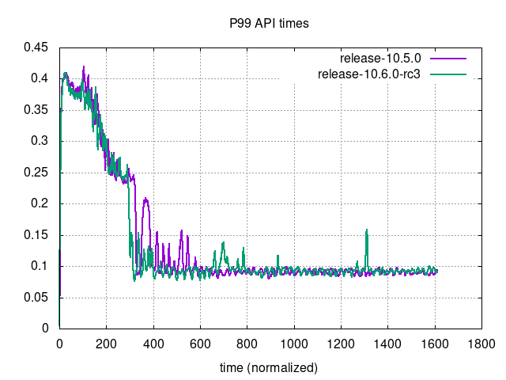                             |
| --- | ---|
| 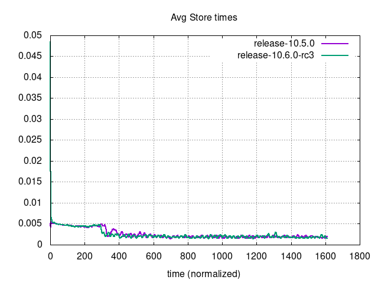 | 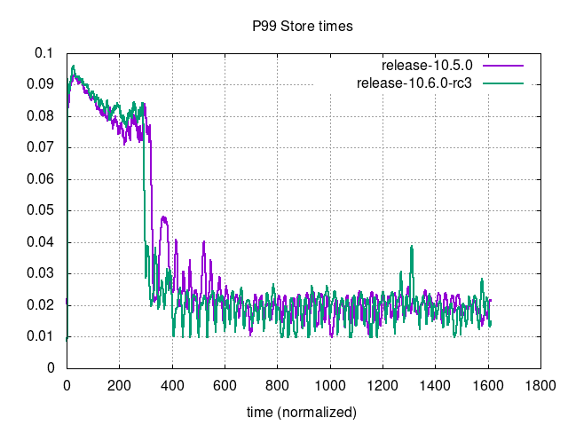                         |
|  | 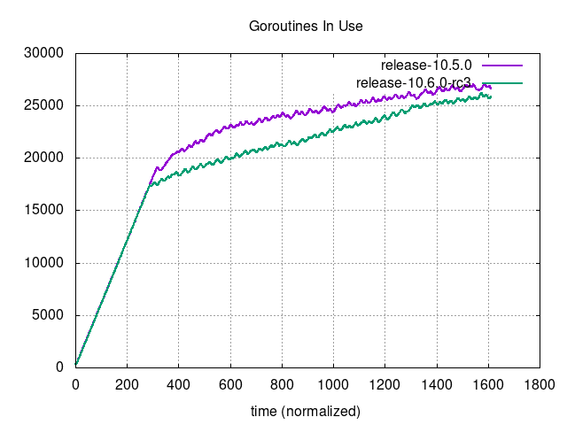                     |
| 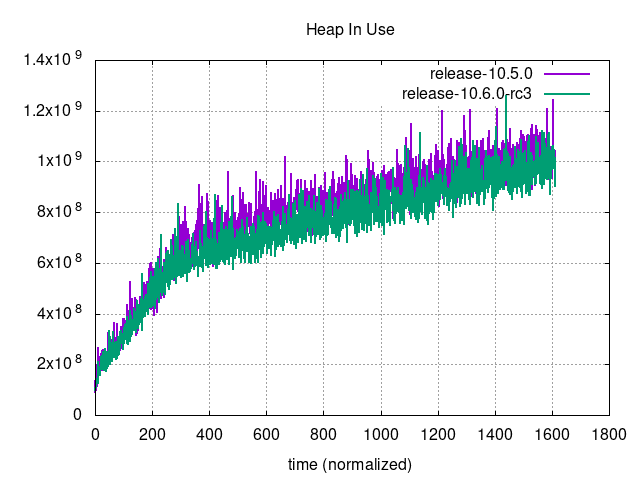         |  |
| 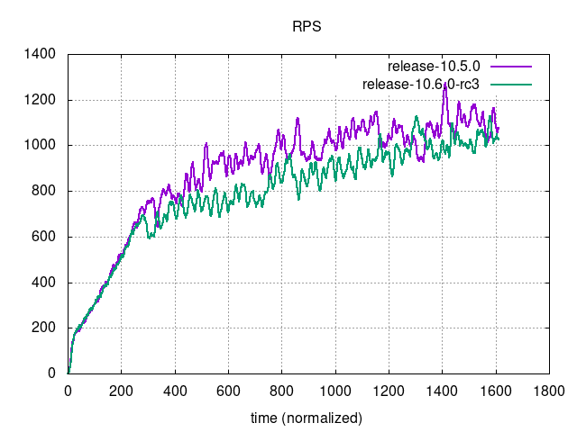                         |                                |
