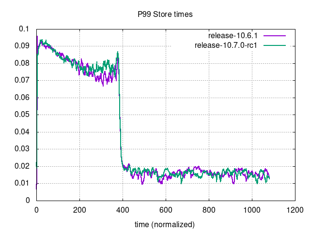
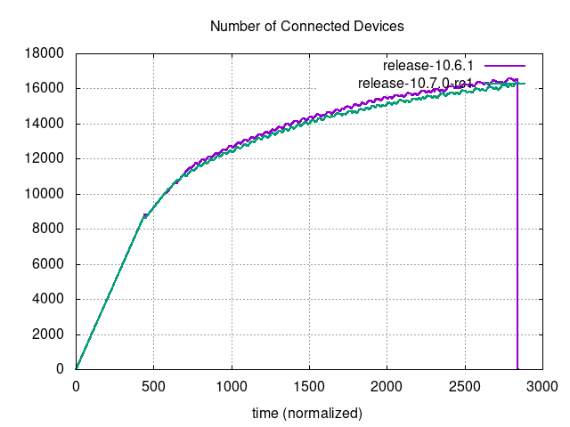

# Performance Comparison `v10.6.1` vs `v10.7.0-rc1`

## Comments

- One of the most boring performance comparisons as of late (boring is good!).
- Metrics monitored in bounded tests show no significant differences.
- Differences of number of supported users in unbounded tests are no significant either: -0.28% for MySQL, -1.11% for Postgres. Both well between the bounds of \[-5%, +5%\].

## Action Items

- Release can continue as planned.
- No other action needed.

## Setup

| Setting                              | Value                                                                                                                                                                                      |
| ------------------------------------ | ------------------------------------------------------------------------------------------------------------------------------------------------------------------------------------------ |
| Load-test version                    | [`v1.25.0`](https://github.com/mattermost/mattermost-load-test-ng/releases/tag/v1.25.0)                                                                                                    |
| Dataset                              | Dump from `v6.1.0`, 12M posts ([postgres](https://lt-public-data.s3.amazonaws.com/12M_610_fixed_psql.sql.gz), [mysql](https://lt-public-data.s3.amazonaws.com/12M_610_fixed_mysql.sql.gz)) |
| Bounded - number of users (Postgres) | 7500                                                                                                                                                                                       |
| Bounded - number of users (MySQL)    | 5000                                                                                                                                                                                       |
| Bounded - duration                   | 90 minutes                                                                                                                                                                                 |
| Unbounded - MaxActiveUsers           | 20000                                                                                                                                                                                      |
| Unbounded - num of users per agent   | 2000                                                                                                                                                                                       |
| App instances                        | 2 x c7i.2xlarge                                                                                                                                                                            |
| Agent instances                      | 11 x c7i.xlarge                                                                                                                                                                            |
| Proxy Instance                       | 1 x c7i.xlarge                                                                                                                                                                             |
| DB instances                         | 2 x db.r7g.2xlarge                                                                                                                                                                         |

## Results

### Grafana

These are snapshots of the original Grafana dashboards.

- [Bounded - MySQL](https://snapshots.raintank.io/dashboard/snapshot/nd104vSWMo4NVBMdToF3ShbWNiEuMecg)
- [Bounded - Postgres](https://snapshots.raintank.io/dashboard/snapshot/MXEgK0wVZio0c9SRcfkoyXNFXRT7JYJ3)
- [Unbounded - MySQL](https://snapshots.raintank.io/dashboard/snapshot/hZpPLTNqvffsnlcKCCpOWJquOOtNKTsu)
- [Unbounded - Postgres](https://snapshots.raintank.io/dashboard/snapshot/BKZda8rEJfoafPKY8THSYFNDc0w1nnKz)

### Supported users in unbounded tests

| Test     | v10.6.1 | v10.7.0-rc1 | Delta   |
| -------- | ------- | ----------- | ------- |
| MySQL    | 16347   | 16301       | \-0.28% |
| Postgres | 17504   | 17310       | \-1.11% |

### Graphs - Bounded MySQL

|  |  |
| --- | ---|
|  |  |
|  |  |
|  |  |
|  |  |

### Graphs - Bounded Postgres

|  |  |
| --- | ---|
|  |  |
|  |  |
|  |  |
|  |  |

### Graphs - Unbounded MySQL

|      |                              |
| --- | --- |
|  |                          |
|  |                      |
|          |  |
|                          |                                |

### Graphs - Unbounded Postgres

|      |                              |
| --- | ---|
|  |                          |
|  |                      |
|          |  |
|                          |                                |
