# Performance Comparison `v10.12.0` vs `v11.0.1-rc2`

## Comments

- The unbounded test shows no significant difference: a 1.34% reduction in the new release, which sits in the \[-5%, +5%\] interval of usual variance.
- The bounded test shows a spike in API times at the end of the ramp-up period.
  - On further investigation, this seems to be caused by [the new password hashing method](https://github.com/mattermost/mattermost/pull/33830) introduced in v11.0, as was already expected.
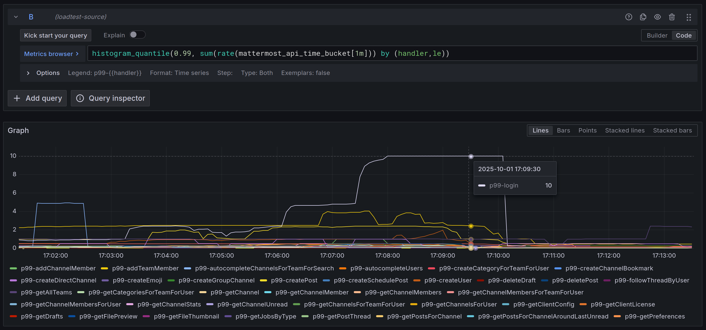
  - The new method is CPU-intensive by design, so there is an increase in CPU usage during the ramp-up period due to logins taking more time. This can be seen in the two screenshots of the CPU usage plot below: the first one shows the ramp-up period, where v11.0 shows slightly more CPU usage throughout the whole period; the second one shows the stable period, where there is no significant difference between v10.12 and v11.0.
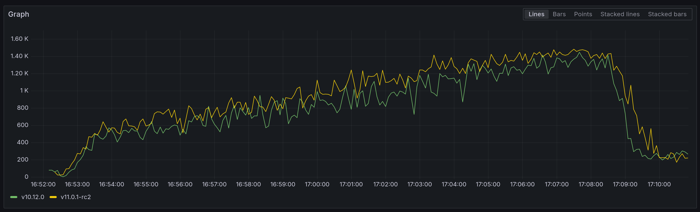
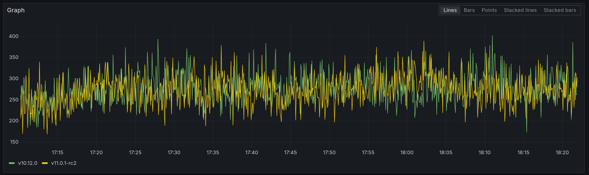
  - This is further exacerbated by the fact that we originally designed these tests to both create users and log them in, so the impact of the new hashing method is seen on both saving and logging the user. This is clearly seen in the diff view of Pyroscope, where we can compare the CPU profiles of the ramp-up period for both v10.12 and v11.0. The first screenshot shows the increase in CPU time when creating a user, while the second shows similar results for logging users in.
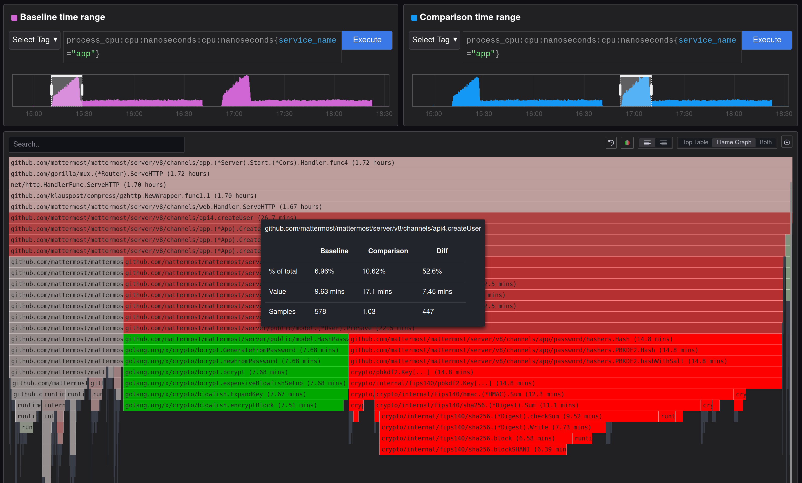
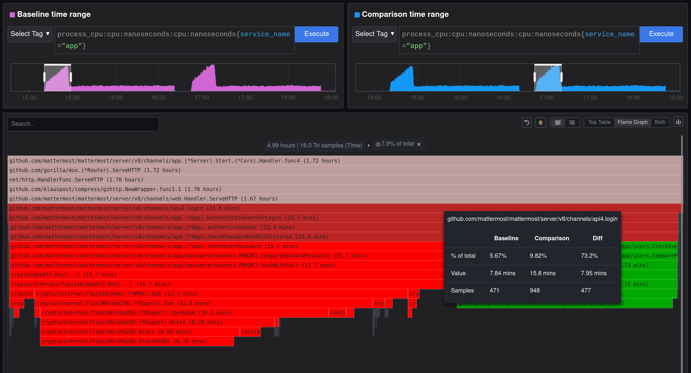
- Despite this analysis, given the successful results of the unbounded tests, and the fact that large servers (which would be the most impacted by the new password hashing method) should never use password-based login (it has always been more CPU-intensive than other methods), we do not see this as a performance regression by itself: more secure hashing methods are, by design, more resource-intensive. However, admins should probably keep an eye out on CPU usage when upgrading to v11.0.

- Bonus comment: Note how I said "unbounded test" and "bounded test", in **singular**? That is because this is the first ever performance comparison **without** MySQL tests, only PostgreSQL, let's celebrate\! :tada:

## Action Items

- Add a section to the release notes indicating that the new password hashing method is more CPU-intensive, and that admins of servers with password-based login should monitor the performance on periods where many users log in at the same time.
- Release can continue as planned.

## Setup

| Setting                              | Value                                                                                                                                                                                      |
| ------------------------------------ | ------------------------------------------------------------------------------------------------------------------------------------------------------------------------------------------ |
| Load-test version                    | [`v1.29.0`](https://github.com/mattermost/mattermost-load-test-ng/releases/tag/v1.29.0)                                                                                                    |
| Dataset                              | Dump from `v6.1.0`, 12M posts ([postgres](https://lt-public-data.s3.amazonaws.com/12M_610_fixed_psql.sql.gz), [mysql](https://lt-public-data.s3.amazonaws.com/12M_610_fixed_mysql.sql.gz)) |
| Bounded - number of users (Postgres) | 7500                                                                                                                                                                                       |
| Bounded - number of users (MySQL)    | 5000                                                                                                                                                                                       |
| Bounded - duration                   | 90 minutes                                                                                                                                                                                 |
| Unbounded - MaxActiveUsers           | 20000                                                                                                                                                                                      |
| Unbounded - num of users per agent   | 2000                                                                                                                                                                                       |
| App instances                        | 2 x c7i.2xlarge                                                                                                                                                                            |
| Agent instances                      | 11 x c7i.xlarge                                                                                                                                                                            |
| Proxy Instance                       | 1 x c7i.xlarge                                                                                                                                                                             |
| DB instances                         | 2 x db.r7g.2xlarge                                                                                                                                                                         |

## Results

### Grafana

These are snapshots of the original Grafana dashboards.

- [Bounded test](https://snapshots.raintank.io/dashboard/snapshot/TNo9AdcDcVk3gm3rx62Eg82Q0no2s9V5)
- [Unbounded test](https://snapshots.raintank.io/dashboard/snapshot/rRb5KPhGiRsL5Co1qKMK3oJwAKNIbVZZ)

### Supported users in unbounded test

| v10.12.0 | v11.0.1-rc2 | Delta   |
| -------- | ----------- | ------- |
| 17272    | 17040       | \-1.34% |

### Graphs - Bounded

| 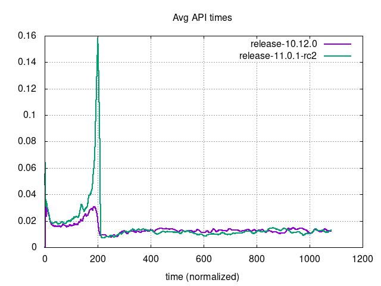 | 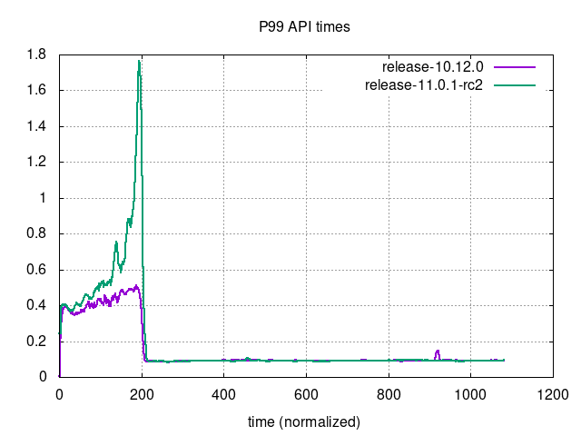 |
| --- | ---|
| 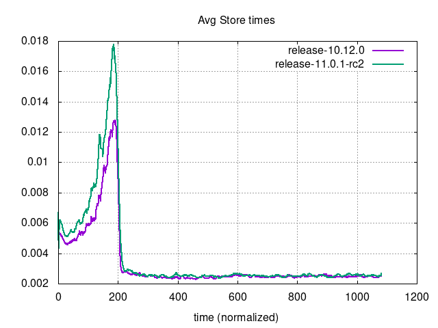 | 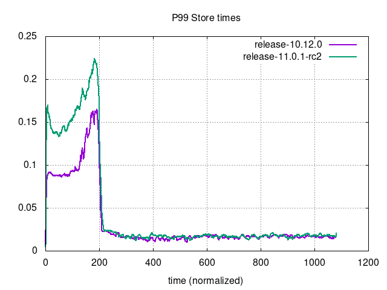 |
| 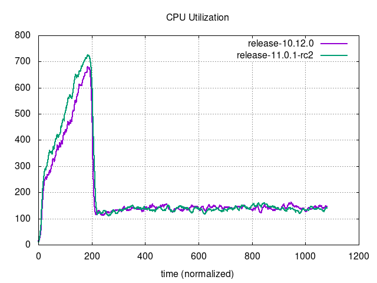 | 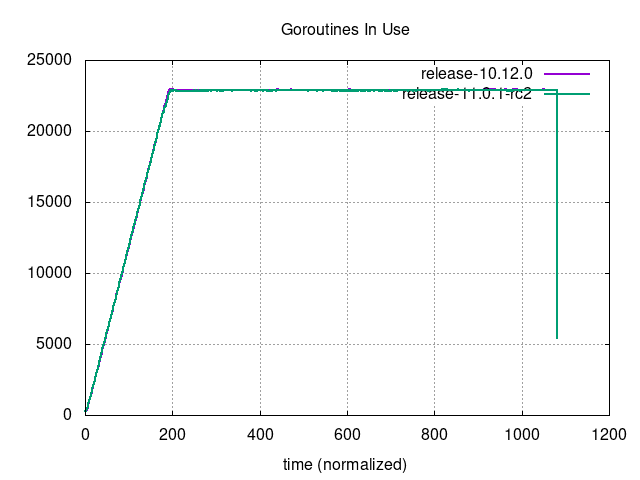 |
| 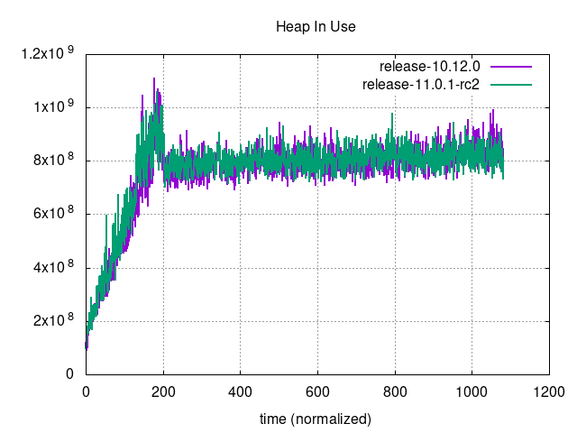 | 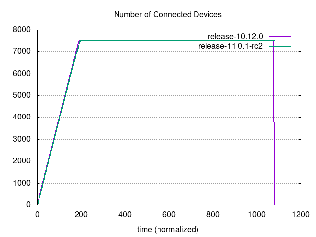 |
| 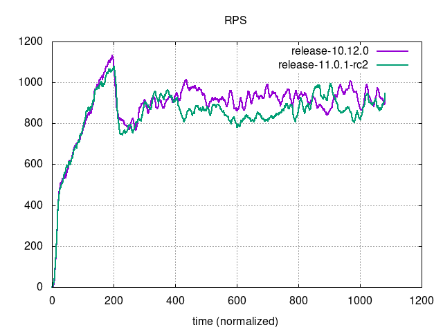 | 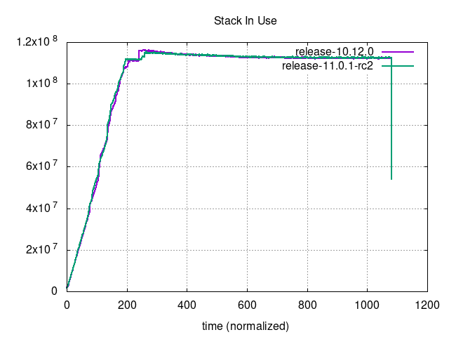 |

### Graphs - Unbounded

| 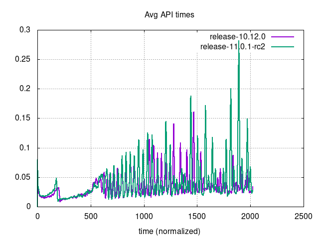     | 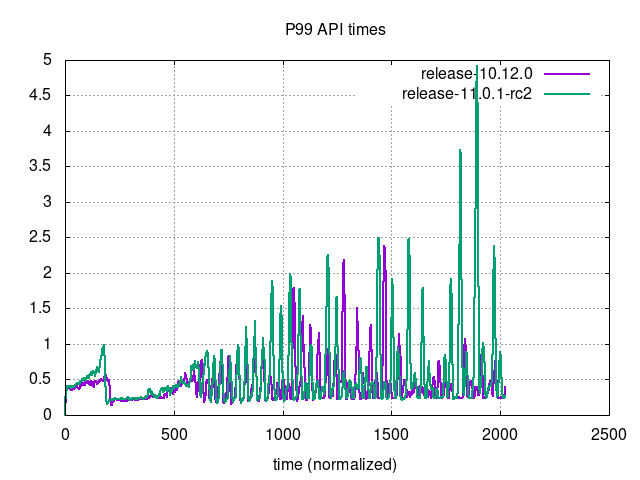                             |
| --- | ---|
| 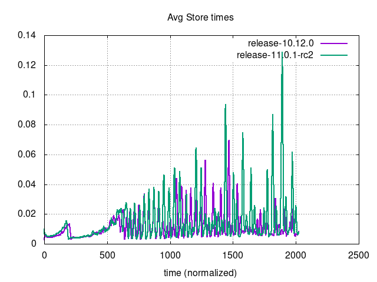 | 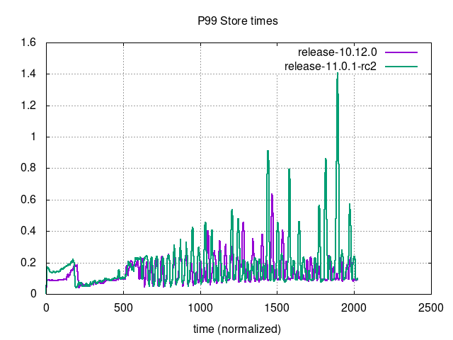                         |
| 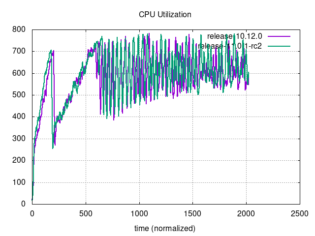 | 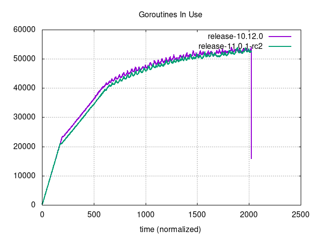                     |
| 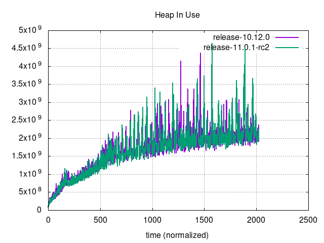         | 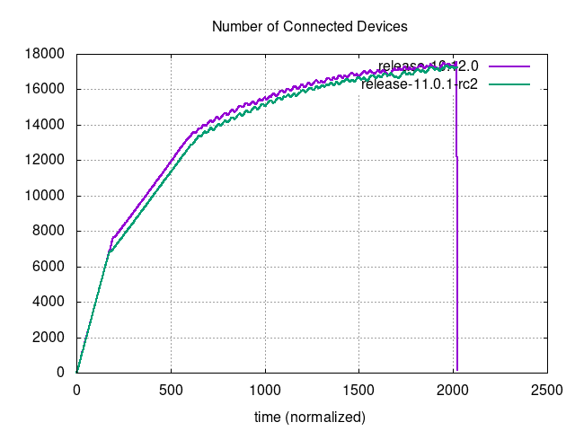 |
| 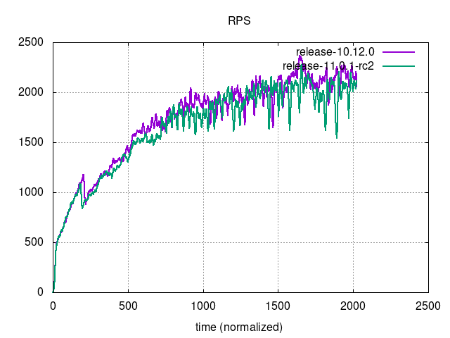                         | 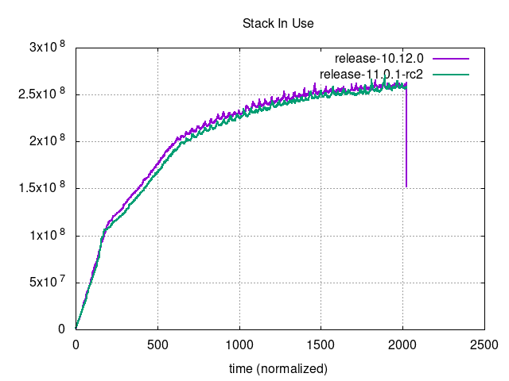                               |
