# Performance Comparison `v11.0.4` vs `v11.1.0-rc2`

## Comments

- The unbounded test shows no significant difference: a 3.64% decrease of supported users for the new release, which lies in the \[-5%, +5%\] interval of usual variance.
- The bounded test shows no significant difference either in any of the metrics considered.
  - However, we had to reduce the number of users in this test, from the usual 7500 to 5000. The first tests, with a ceiling of 7500 users, failed to reach that number, with the server being completely overloaded after reaching around 6000 users. This created a cascade of issues that ended up spiking the API times, increasing the timeouts metric as well. See more information in [the corresponding thread](https://community.mattermost.com/core/pl/aqoma8yzmtfzirdgqp8577rq9o).
  - This issue happened on both the base and new builds, so there is no real concern on a performance regression in v11.1.0, but a mismatch in the specs of the test for this load.
  - The current hypothesis for the need of this change is the additional load on the login process introduced in v11.0 with the new hashing algorithm, but this is something that we need to keep investigating.

## Action Items

- Release can continue as planned.
- In parallel, the Reliability team will spend some time on trying to pinpoint the reason for the bounded test issues: [MM-66551](https://mattermost.atlassian.net/browse/MM-66551).

## Setup

| Setting                              | Value                                                                                              |
| ------------------------------------ | -------------------------------------------------------------------------------------------------- |
| Load-test version                    | [`v1.29.0`](https://github.com/mattermost/mattermost-load-test-ng/releases/tag/v1.29.0)            |
| Dataset                              | [Dump from `v6.1.0`, 12M posts](https://lt-public-data.s3.amazonaws.com/12M_610_fixed_psql.sql.gz) |
| Bounded - number of users (Postgres) | 5000                                                                                               |
| Bounded - duration                   | 90 minutes                                                                                         |
| Unbounded - MaxActiveUsers           | 20000                                                                                              |
| Unbounded - num of users per agent   | 2000                                                                                               |
| App instances                        | 2 x c7i.2xlarge                                                                                    |
| Agent instances                      | 11 x c7i.xlarge                                                                                    |
| Proxy Instance                       | 1 x c7i.xlarge                                                                                     |
| DB instances                         | 2 x db.r7g.2xlarge                                                                                 |

## Results

### Grafana

These are snapshots of the original Grafana dashboards.

- [Bounded test](https://snapshots.raintank.io/dashboard/snapshot/Xal2tzD6FCgJI6Buw1hjbNes81H6O9UL)
- [Unbounded test](https://snapshots.raintank.io/dashboard/snapshot/wioHSjYwLhKily1P1nqJh0bN3cPR25sz)

### Supported users in unbounded test

| v11.0.4 | v11.1.0-rc2 | Delta   |
| ------- | ----------- | ------- |
| 16997   | 16378       | \-3.64% |

### Graphs - Bounded

| 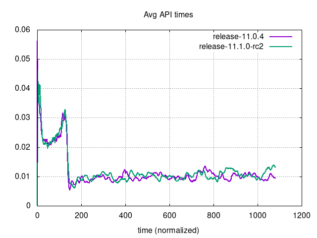 | 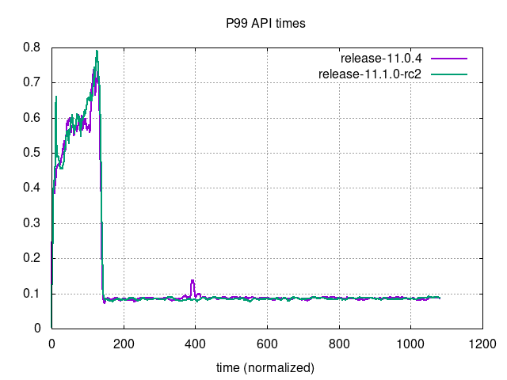 |
| --- | ---|
| 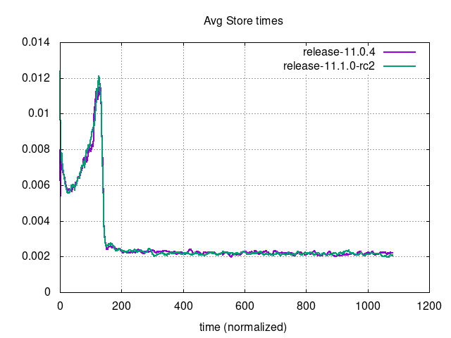 | 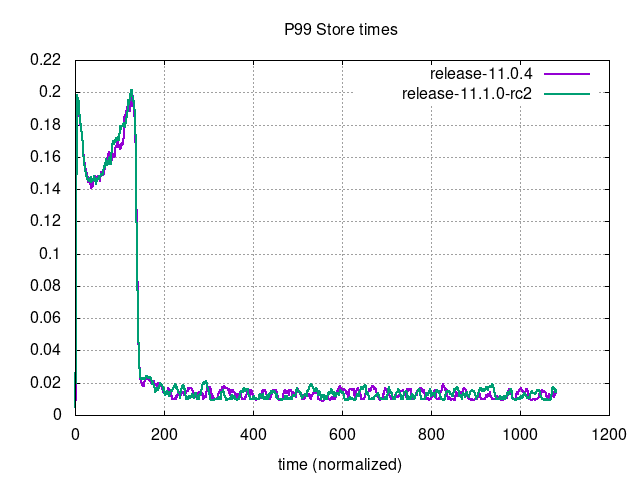 |
| 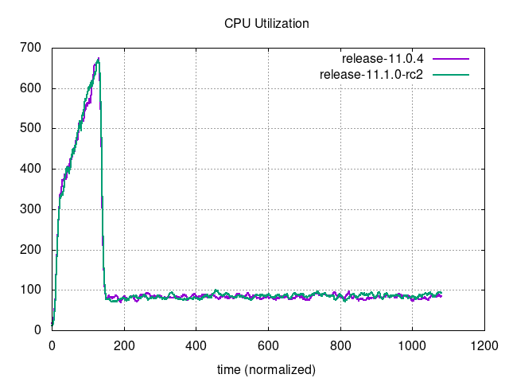 | 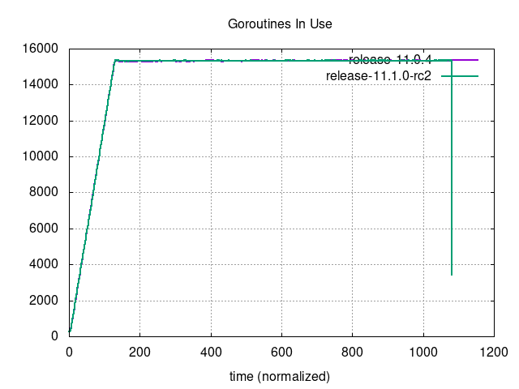 |
| 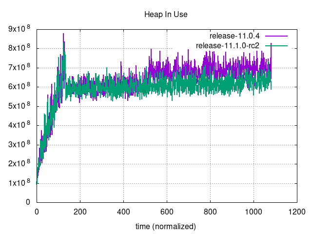 | 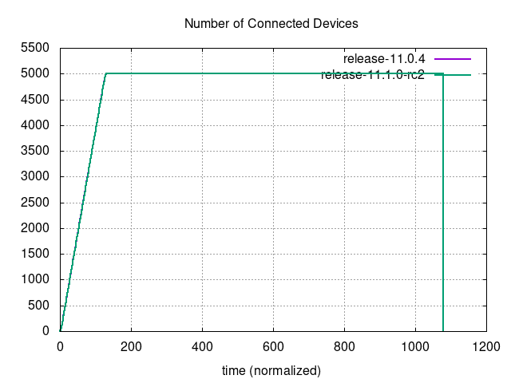 |
| 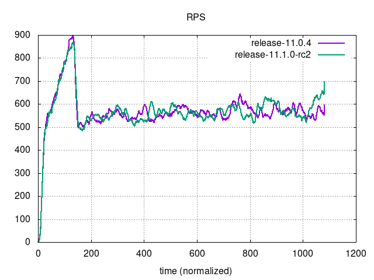 | 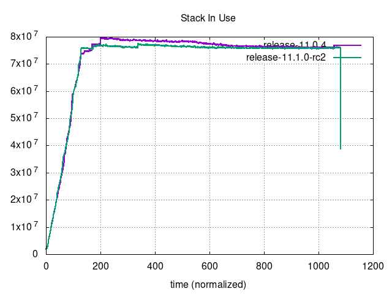 |

### Graphs - Unbounded

| 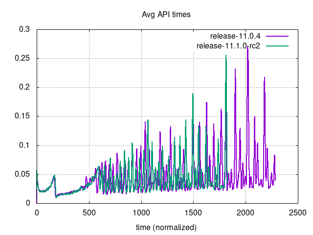     | 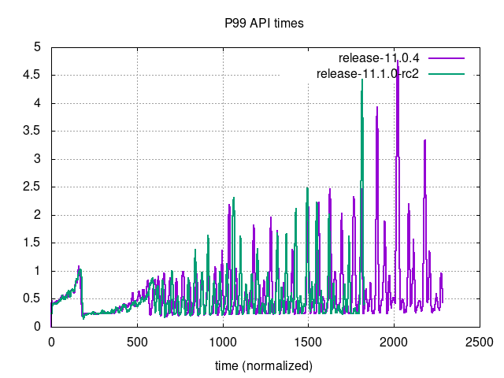                             |
| --- | ---|
| 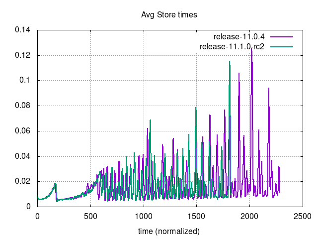 | 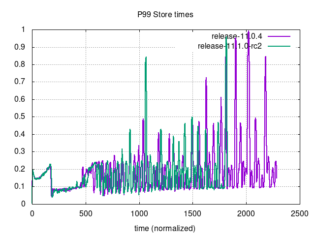                         |
| 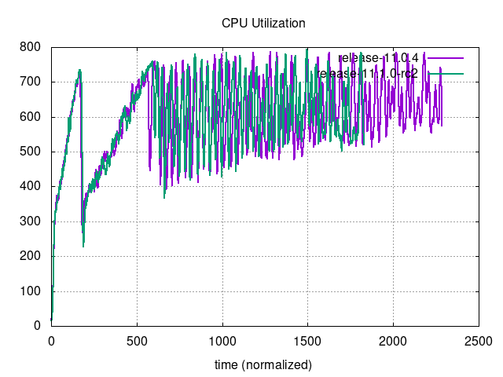 | 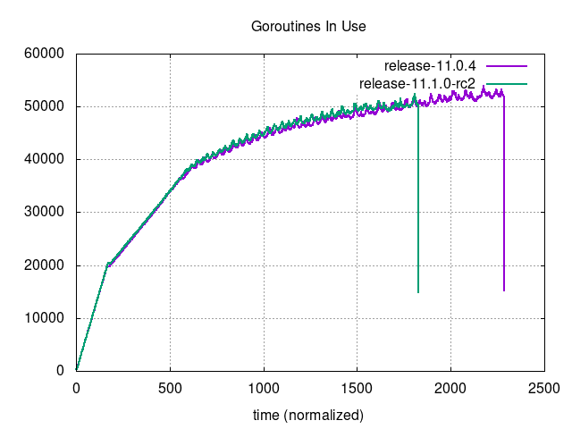                     |
| 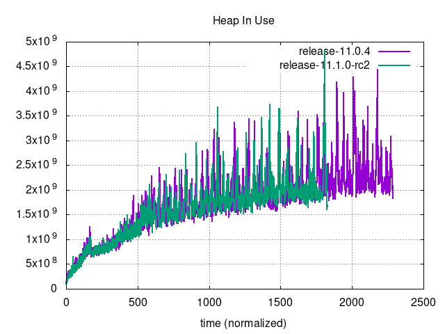         | 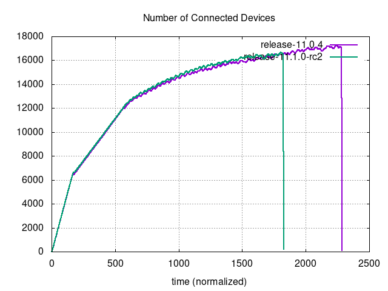 |
| 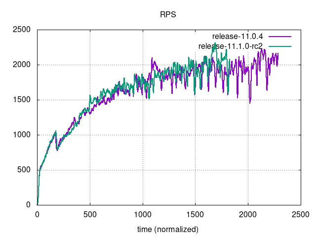                         | 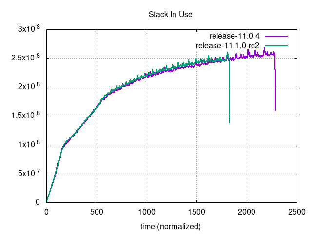                               |
