# Performance Comparison `v11.6.1` vs `v11.7.0-rc2`

## Comments

- A nominal performance comparison:
  - The unbounded test shows a \-0.90% decrease in the number of supported users (from 17202 to 17048), which lies in the \[-5%, +5%\] interval of usual variance.
  - The bounded test shows no significant difference in any of the metrics considered. The few notable swings are concentrated in channel-autocomplete paths (`searchAllChannels` p99 175ms -> 397ms, `autocompleteChannelsForTeamForSearch` p99 49ms -> 99ms), which may be consistent with this release's changes to channel sorting (display-name match prioritization), substring matching for channel-member search, and CJK autocomplete handling.
- `updateCategoriesForTeamForUser` p99 regressed in the unbounded test (922ms -> 2.06s, +123%), which may line up with the Managed Sidebar Categories work landed in this release. This feature has since been put behind a feature flag after RC2, so it is no longer a risk for the release. It does not affect the supported-users figure.

## Action Items

- Release can continue as planned.
- No other action needed.

## Setup

| Setting                              | Value                                                                                              |
| ------------------------------------ | -------------------------------------------------------------------------------------------------- |
| Load-test version                    | [`v1.32.0`](https://github.com/mattermost/mattermost-load-test-ng/releases/tag/v1.32.0)            |
| Dataset                              | [Dump from `v6.1.0`, 12M posts](https://lt-public-data.s3.amazonaws.com/12M_610_fixed_psql.sql.gz) |
| Bounded - number of users            | 6500                                                                                               |
| Bounded - duration                   | 90 minutes                                                                                         |
| Unbounded - MaxActiveUsers           | 20000                                                                                              |
| Unbounded - num of users per agent   | 2000                                                                                               |
| App instances                        | 2 x c7i.2xlarge                                                                                    |
| Agent instances                      | 11 x c7i.xlarge                                                                                    |
| Proxy Instance                       | 1 x c7i.xlarge                                                                                     |
| DB instances                         | 2 x db.r7g.2xlarge                                                                                 |

## Results

### Grafana

These are snapshots of the original Grafana dashboards.

- [Bounded test](https://snapshots.raintank.io/dashboard/snapshot/dC3bZRWyaE03Ar0hTgsYqDIYsu4ETWxx)
- [Unbounded test](https://snapshots.raintank.io/dashboard/snapshot/0ab6na9UzZrWUMMpsj3NJv04QlBhuYeO)

### Supported users in unbounded test

| v11.6.1 | v11.7.0-rc2 | Delta   |
| ------- | ----------- | ------- |
| 17202   | 17048       | \-0.90% |

### Graphs - Bounded

| 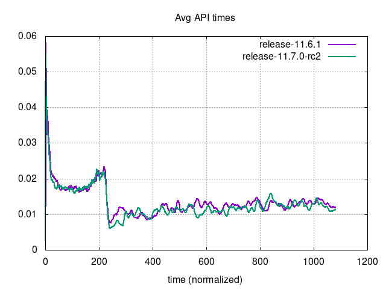     | 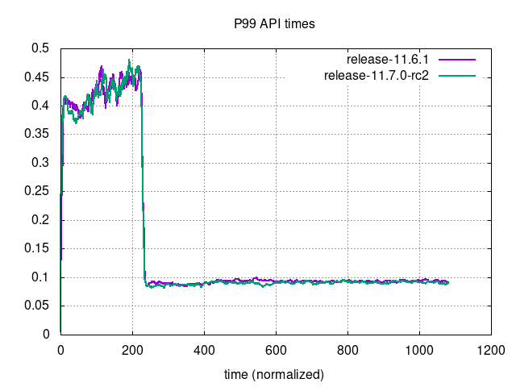                             |
|------------------------------------------------------------------------------------------|------------------------------------------------------------------------------------------------------------------|
| 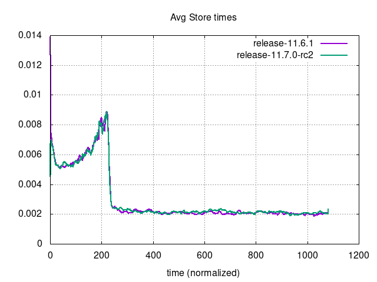 | 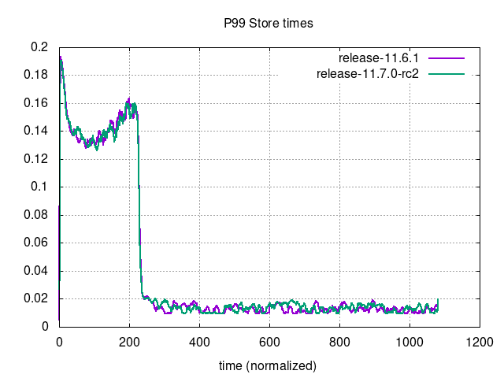                         |
| 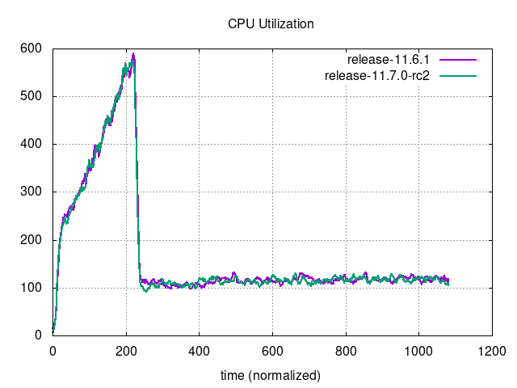 | 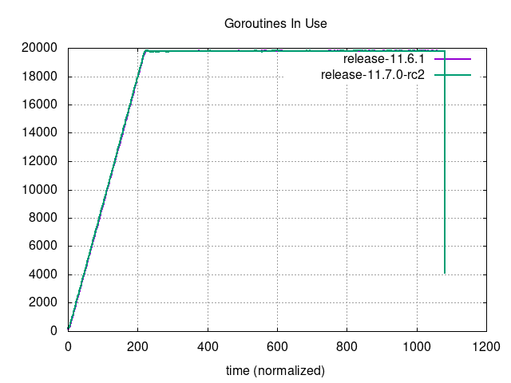                     |
| 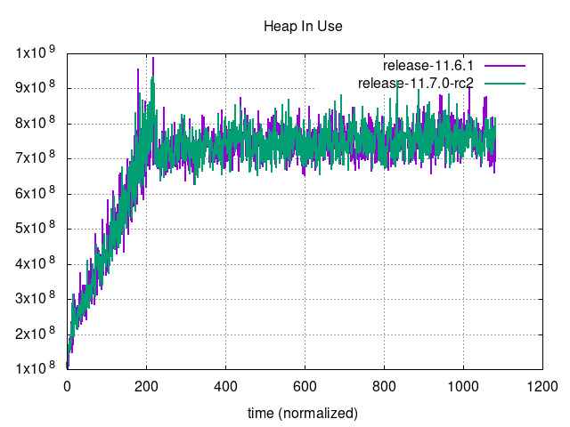         | 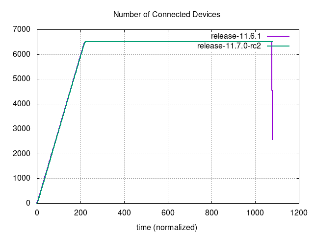 |
| 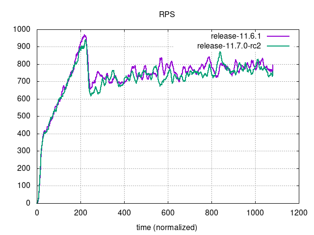                         | 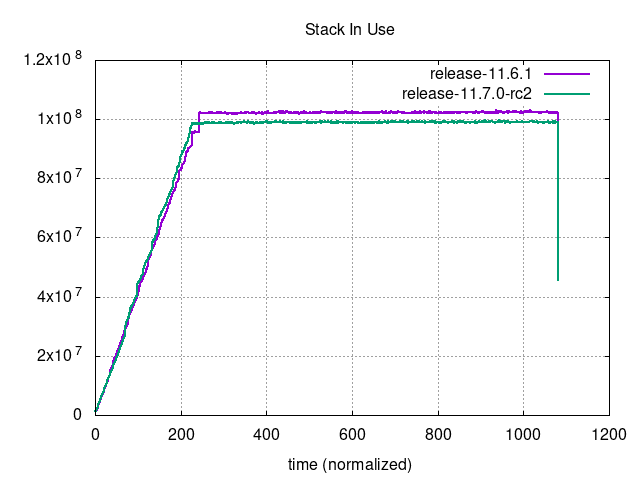                               |

### Graphs - Unbounded

| 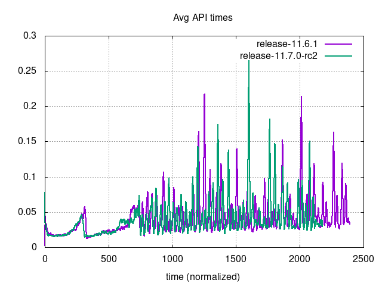     | 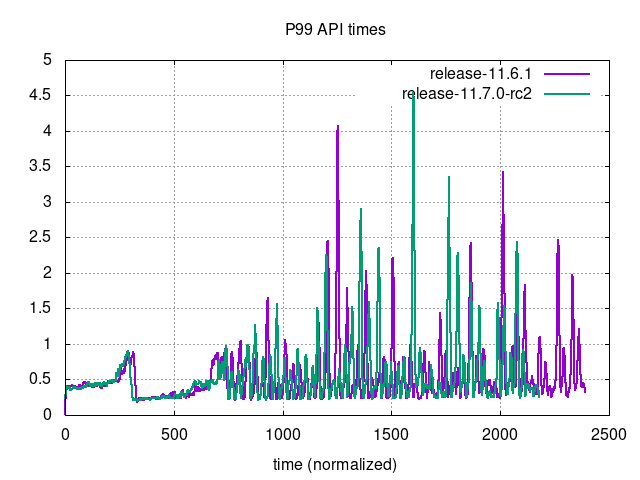                             |
|----------------------------------------------------------------------------------------------|----------------------------------------------------------------------------------------------------------------------|
| 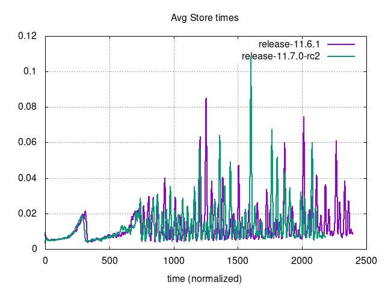 | 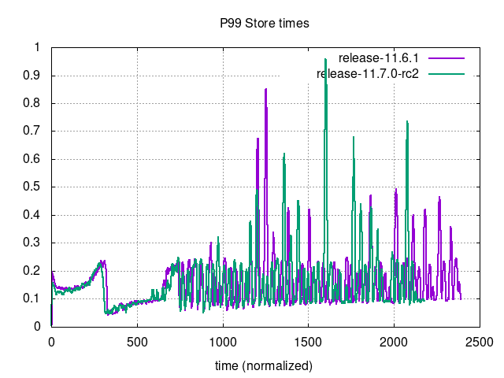                         |
| 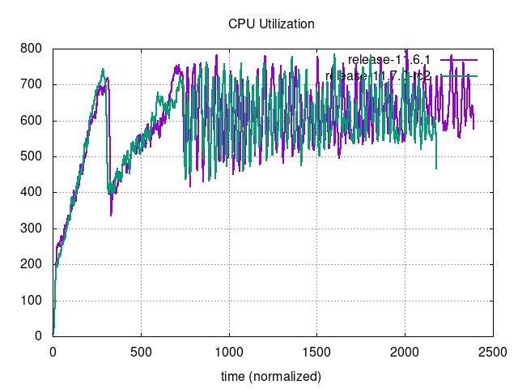 | 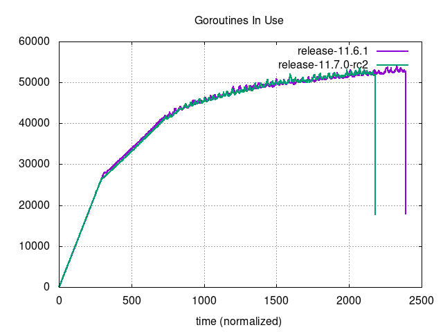                     |
| 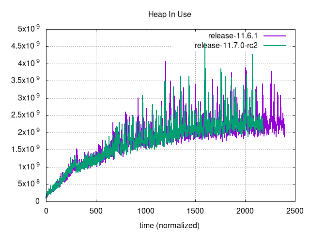         | 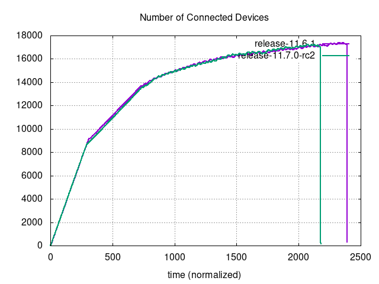 |
| 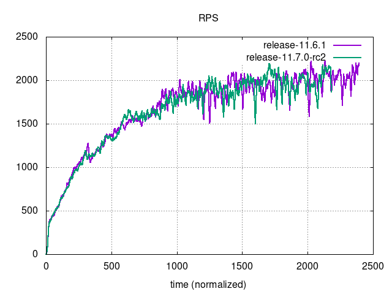                         | 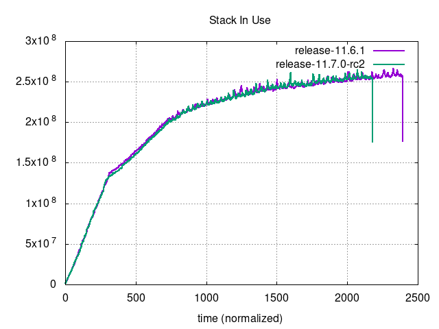                               |
|                                                                                              |                                                                                                                      |
