# Performance Comparison `v11.7.1` vs `v11.8.0-rc3`

## Comments

- A nominal performance comparison, slightly in the favorable direction:
    - The unbounded test shows a +5.30% increase in the number of supported users: from 15936 to 16781. This slightly exceeds the \[-5%, +5%\] interval of usual variance, but it does so in the favorable direction (more supported users), so it is not a concern for the release. This is possibly caused by [the database serialization of logins replacing the global mutex](https://github.com/mattermost/mattermost/pull/36515) (thank you Julien, Ben and Jesse for all the work here!).
    - The bounded test shows no significant difference in the user-facing hot paths (post creation, channel loading, websocket handling). Bounded errors are essentially flat (7678 -> 7821, +1.86%). The larger unbounded error count (81767 -> 117370) is consistent with the higher number of users driven before saturation, not with a regression.
- Minor findings:
    - Post search regressed consistently across both tests: `searchPostsInTeam` avg 36ms -> 113ms (+214%) / p99 670ms -> 965ms in the bounded test, and avg 98ms -> 278ms / p99 1.895s -> 2.447s in the unbounded test, tracking the underlying `PostStore.SearchPostsForUser`. 
    - `PostStore.AnalyticsPostCount` shows a large relative jump in the bounded test (avg 2ms -> 138ms, p99 5ms -> 495ms) and a smaller one in the unbounded test (avg 171ms -> 259ms). It is an analytics/admin path; the user-facing `getAnalytics` endpoint was effectively unchanged in the bounded test (avg 42ms -> 44ms, p99 50ms -> 50ms), so the impact is limited.
    - Both of these are most likely noise: we usually see some variance here and there is no change in these code paths that could have caused this change. [PR #36506](https://github.com/mattermost/mattermost/pull/36506) did change the stats of the `Posts` table, but only to increase the accuracy of the planner when the `RootId` and `ChannelId` columns are involved, so it's unlikely it caused these changes.
    - One thing worth noting about that PR is that we included an `ANALYZE` in a migration, which is a first for us. This will not affect the overall performance (if any, it will improve it), but we should make it quite clear in the release notes for admins to know in advance.

## Action Items

- Release can continue as planned.

## Setup

| Setting                              | Value                                                                                              |
| ------------------------------------ | -------------------------------------------------------------------------------------------------- |
| Load-test version                    | [`v1.32.0`](https://github.com/mattermost/mattermost-load-test-ng/releases/tag/v1.32.0)            |
| Dataset                              | [Dump from `v6.1.0`, 12M posts](https://lt-public-data.s3.amazonaws.com/12M_610_fixed_psql.sql.gz) |
| Bounded - number of users            | 6500                                                                                               |
| Bounded - duration                   | 90 minutes                                                                                         |
| Unbounded - MaxActiveUsers           | 20000                                                                                              |
| Unbounded - num of users per agent   | 2000                                                                                               |
| App instances                        | 2 x c7i.2xlarge                                                                                    |
| Agent instances                      | 11 x c7i.xlarge                                                                                    |
| Proxy Instance                       | 1 x c7i.xlarge                                                                                     |
| DB instances                         | 2 x db.r7g.2xlarge                                                                                 |

## Results

### Grafana

These are snapshots of the original Grafana dashboards.

- [Bounded test](https://snapshots.raintank.io/dashboard/snapshot/F6XUkXa4rpzwwE3zJbQaMzUDHbHuarnX)
- [Unbounded test](https://snapshots.raintank.io/dashboard/snapshot/YApMEzC0PsqRNCYEyTBomn9TEu1AY8fZ)

### Supported users in unbounded test

| v11.7.1 | v11.8.0-rc3 | Delta   |
| ------- | ----------- | ------- |
| 15936   | 16781       | +5.30%  |

### Graphs - Bounded

| 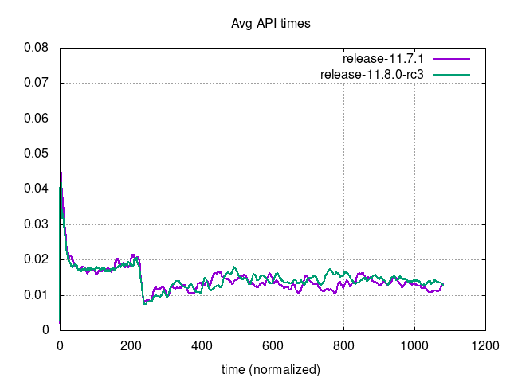     | 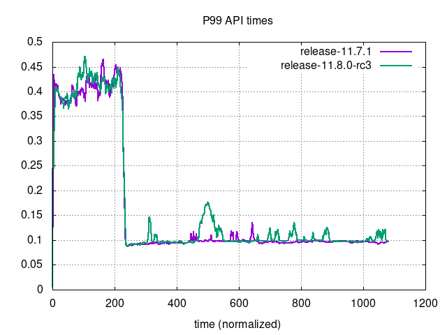                             |
|------------------------------------------------------------------------------------------|------------------------------------------------------------------------------------------------------------------|
| 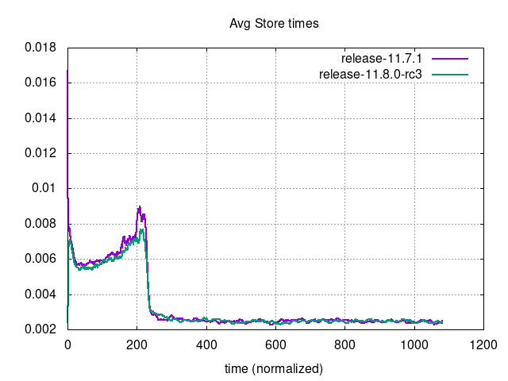 | 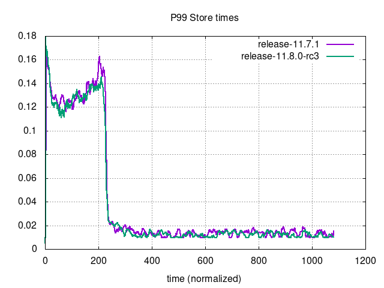                         |
| 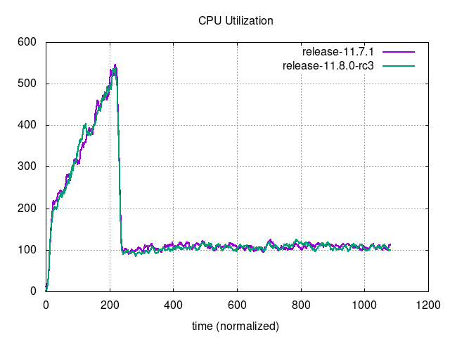 | 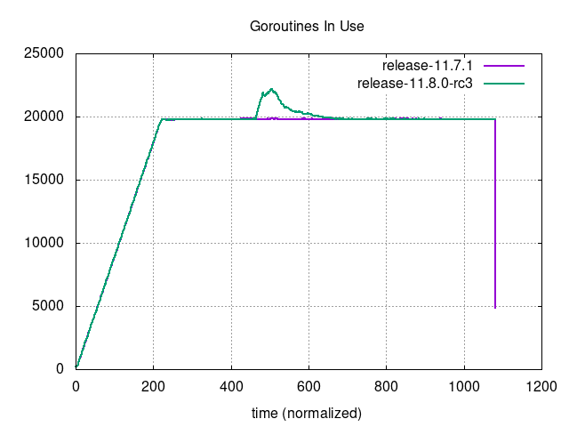                     |
| 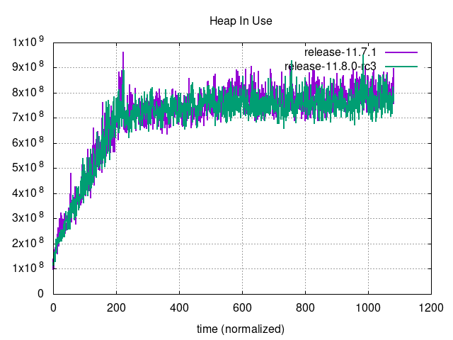         | 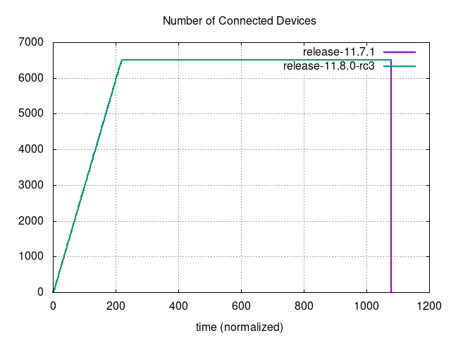 |
| 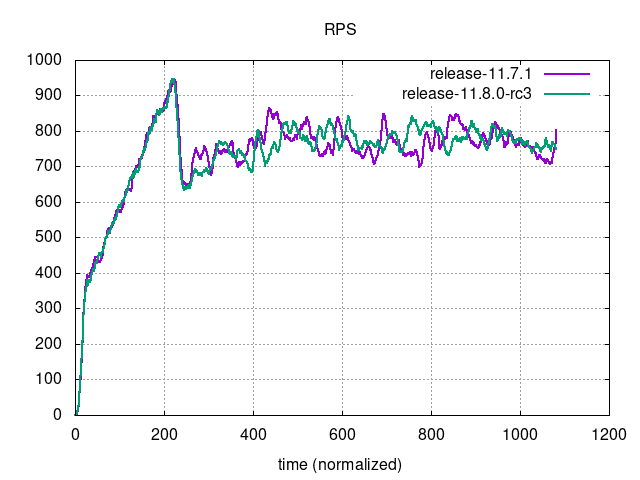                         | 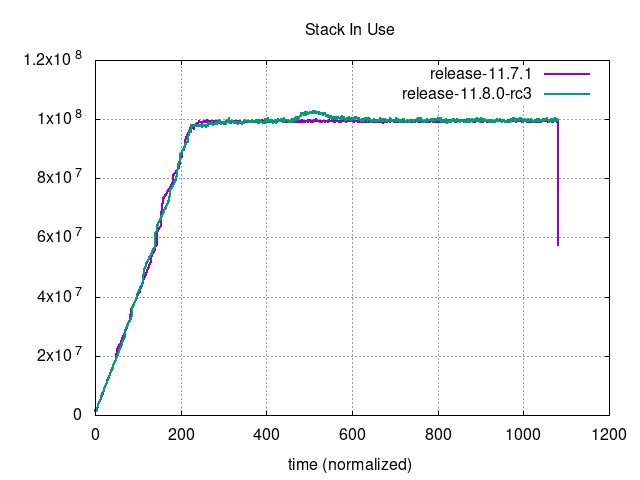                               |

### Graphs - Unbounded

| 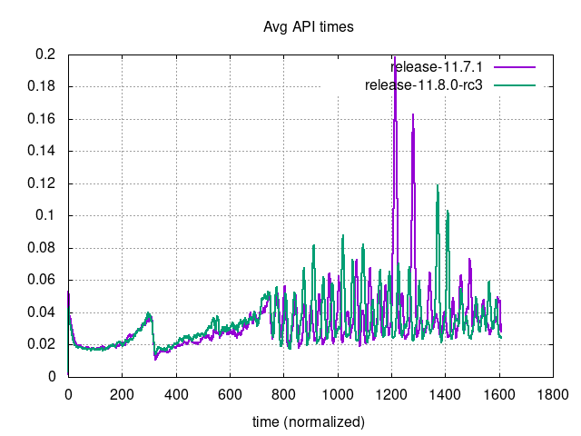     | 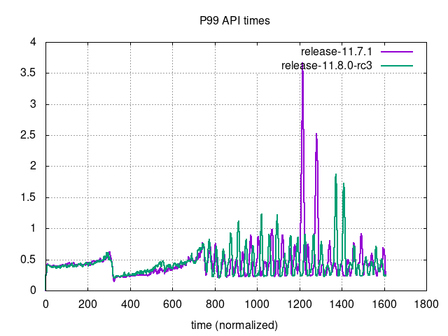                             |
|----------------------------------------------------------------------------------------------|----------------------------------------------------------------------------------------------------------------------|
| 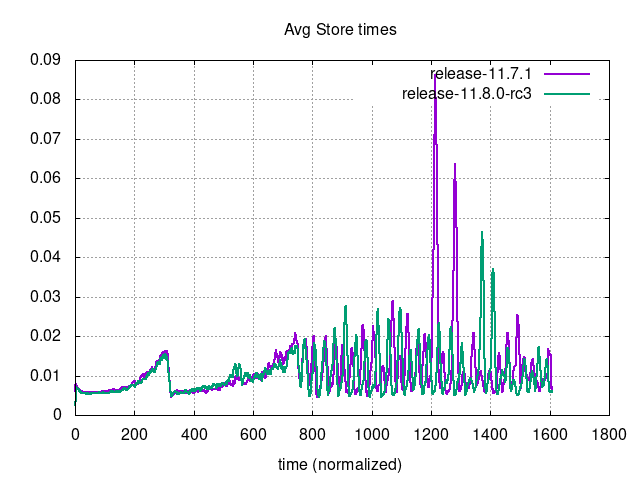 | 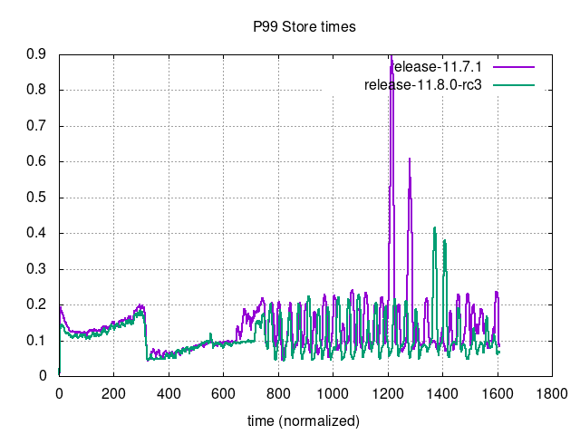                         |
| 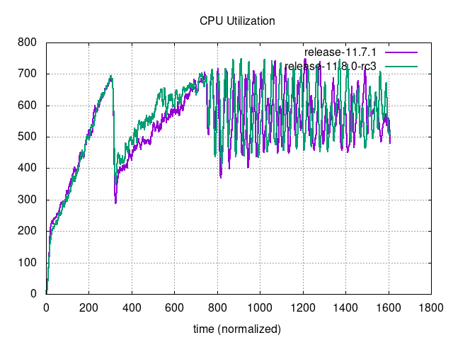 | 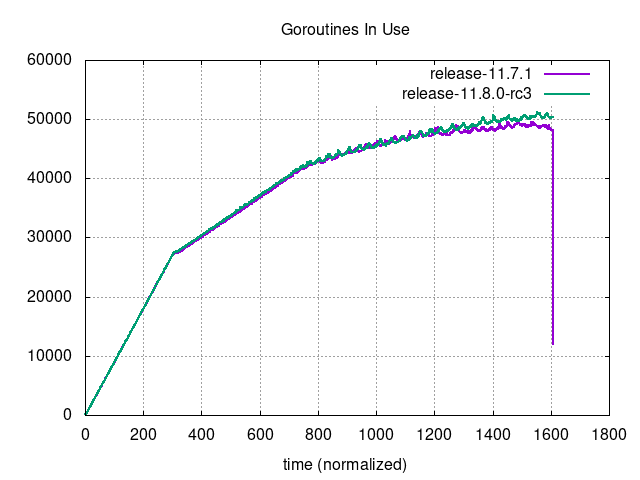                     |
| 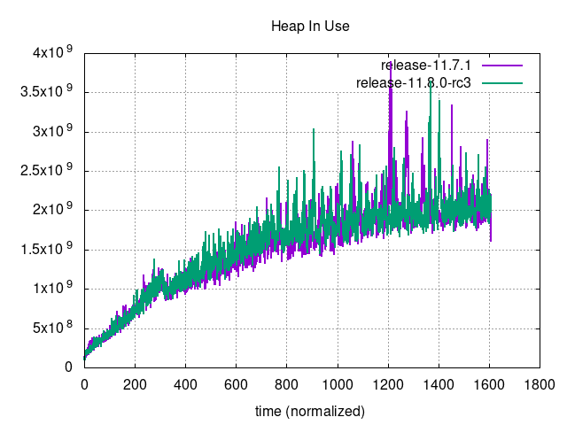         | 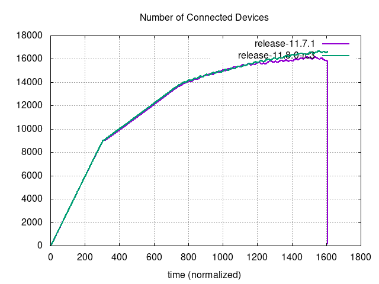 |
| 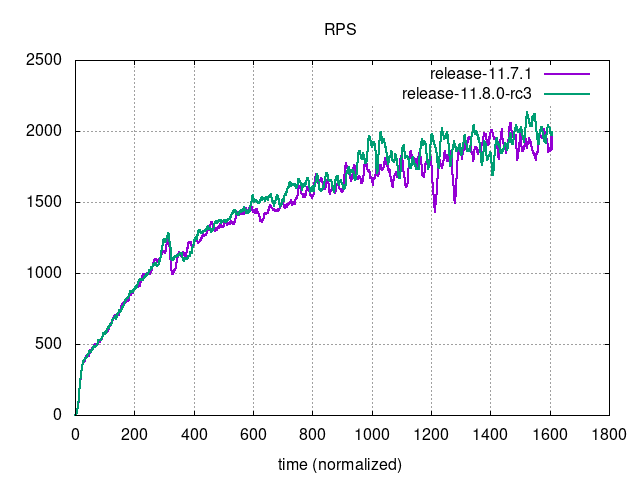                         | 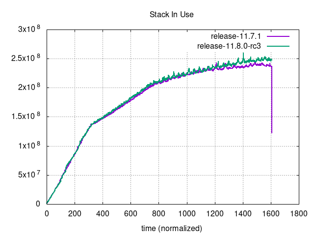                               |
