# Performance Comparison `v11.8.2` vs `v11.9.0-rc2`

## Comments

- The comparison shows no significant difference in performance between the two versions:
  - **Unbounded test**: the unbounded test shows a +1.44% increase in the number of supported users (18034 → 18293), which lies in the \[-5%, +5%\] interval of usual variance.
  - **Bounded test**: the bounded test shows no significant difference in any of the metrics considered. 

## Action Items

- Release can continue as planned.

## Setup

| Setting                              | Value                                                                                              |
| ------------------------------------ | -------------------------------------------------------------------------------------------------- |
| Load-test version                    | [`v1.32.0`](https://github.com/mattermost/mattermost-load-test-ng/releases/tag/v1.32.0)           |
| Dataset                              | [Dump from `v6.1.0`, 12M posts](https://lt-public-data.s3.amazonaws.com/12M_610_fixed_psql.sql.gz) |
| Bounded - number of users            | 6500                                                                                               |
| Bounded - duration                   | 90 minutes                                                                                         |
| Unbounded - MaxActiveUsers           | 20000                                                                                              |
| Unbounded - num of users per agent   | 2000                                                                                               |
| App instances                        | 2 x c7i.2xlarge                                                                                    |
| Agent instances                      | 11 x c7i.xlarge                                                                                    |
| Proxy Instance                       | 1 x c7i.xlarge                                                                                     |
| DB instances                         | 2 x db.r7g.2xlarge                                                                                 |

## Results

### Grafana

These are snapshots of the original Grafana dashboards.

- Bounded test: not available
- Unbounded test: not available

### Supported users in unbounded test

| v11.8.2 | v11.9.0-rc2 | Delta   |
| ------- | ----------- | ------- |
| 18034   | 18293       | +1.44%  |

### Graphs - Bounded

| 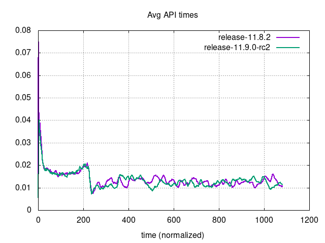 | 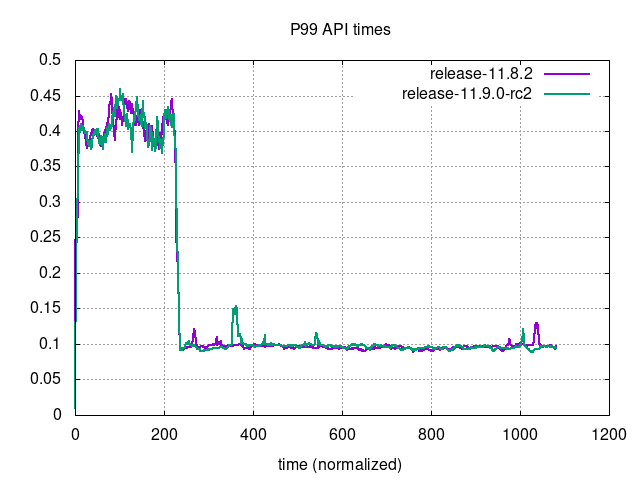 |
| --- | ---|
| 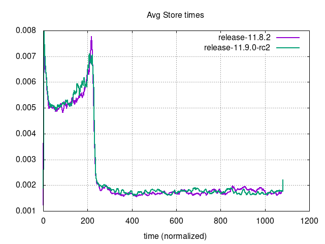 | 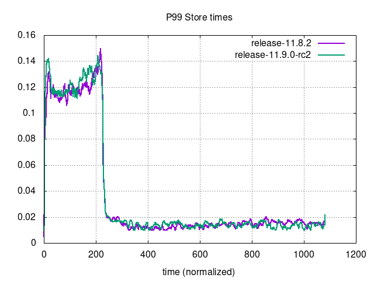 |
| 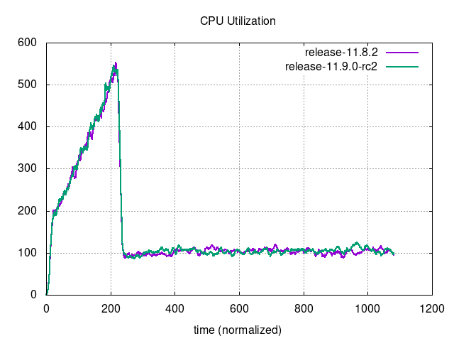 | 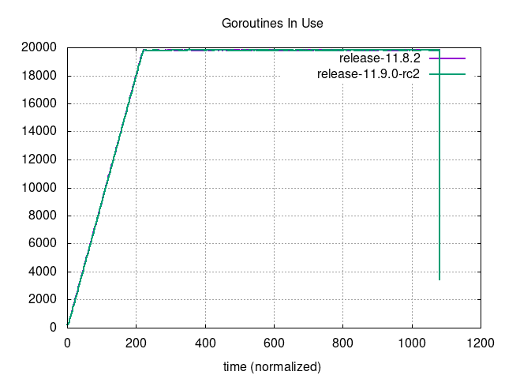 |
| 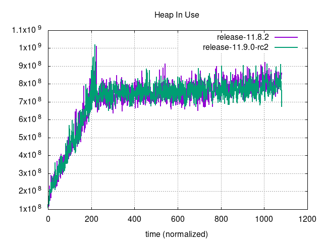 | 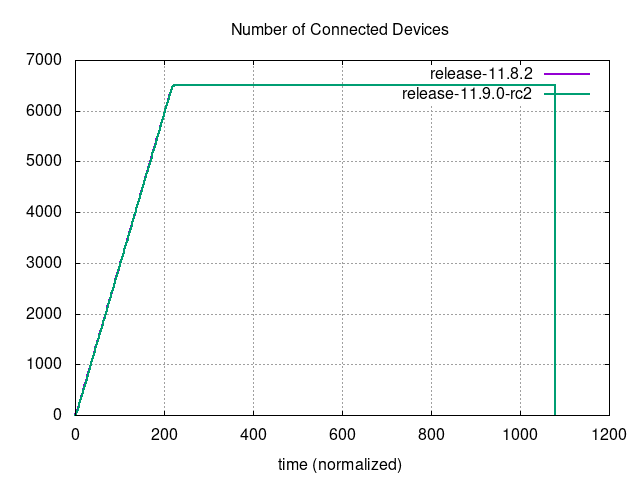 |
| 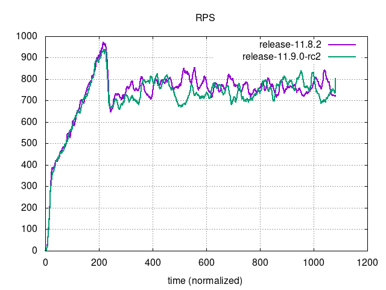 | 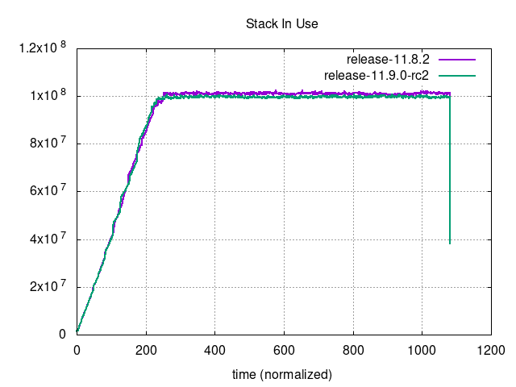 |

### Graphs - Unbounded

| 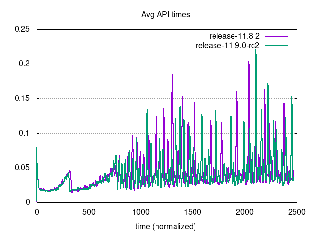     | 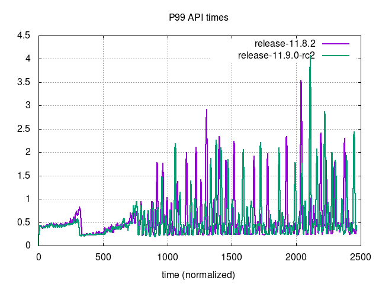                             |
| --- | ---|
| 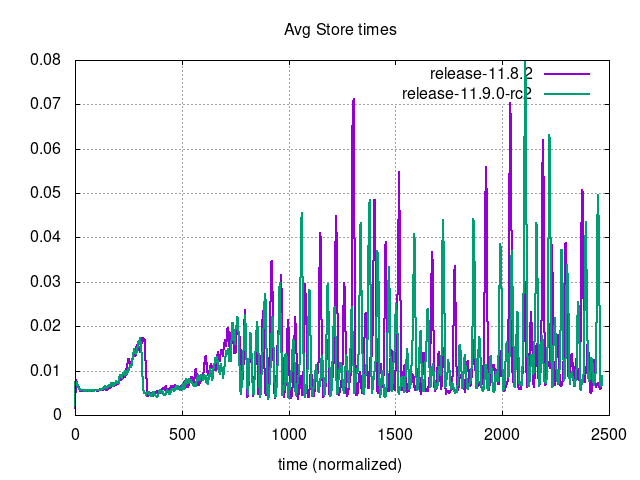 | 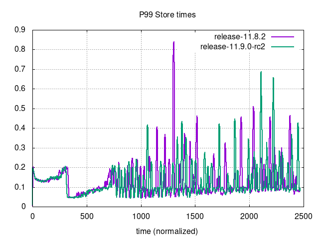                         |
| 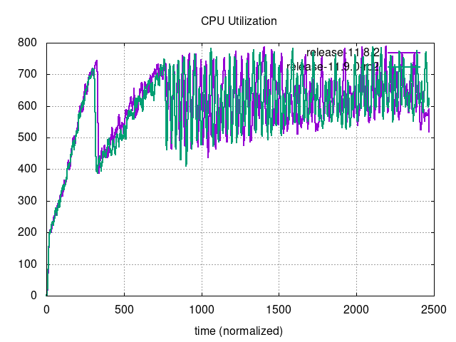 | 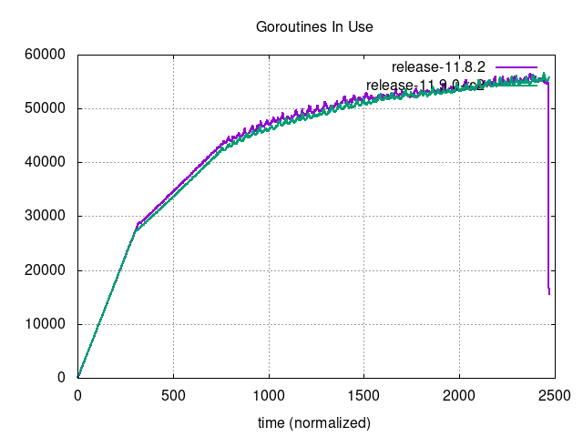                     |
| 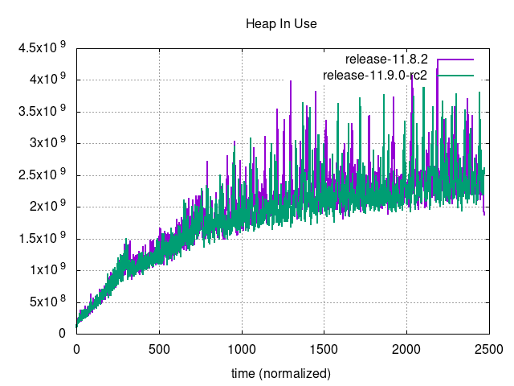         | 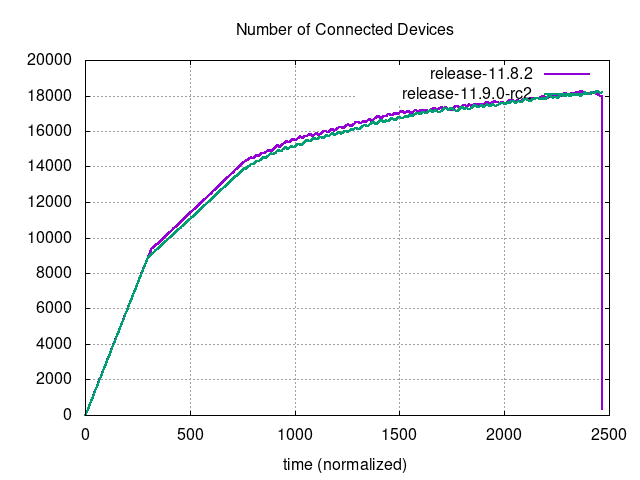 |
| 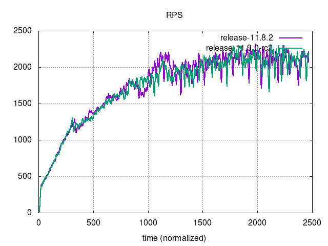                         | 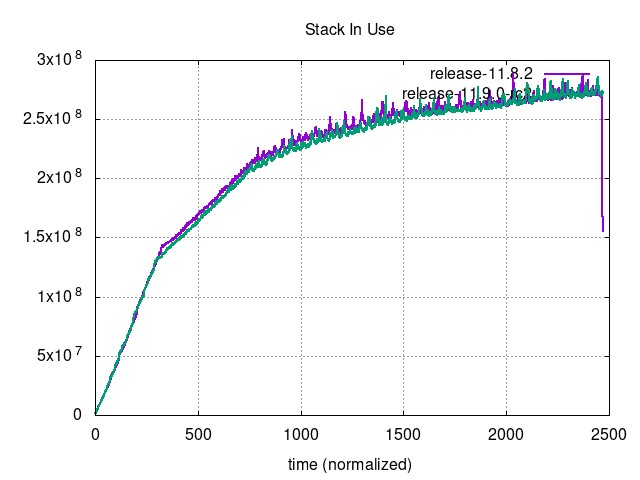                               |
