# Performance Comparison `v11.11.1` vs `v12.0.0-rc2`

## Comments

- Overall results are nominal, with the supported-user count staying within the expected variance interval:
    - The unbounded test shows a \-4.31% decrease in the number of supported users, from 16533 to 15820, which lies in the \[-5%, +5%\] interval of usual variance.
    - The bounded test shows no significant difference in any of the metrics considered.

## Action Items

- Release can continue as planned.

## Setup

| Setting                            | Value                                                                                                |
|------------------------------------|------------------------------------------------------------------------------------------------------|
| Load-test version                  | [`v1.33.0-rc3`](https://github.com/mattermost/mattermost-load-test-ng/releases/tag/v1.33.0-rc3)      |
| Dataset                            | [Dump from `v11.11.0`, 12M posts](https://lt-public-data.s3.amazonaws.com/12M_610_fixed_psql.sql.gz) |
| Bounded - number of users          | 6500                                                                                                 |
| Bounded - duration                 | 90 minutes                                                                                           |
| Unbounded - MaxActiveUsers         | 20000                                                                                                |
| Unbounded - num of users per agent | 2000                                                                                                 |
| App instances                      | 2 x c7i.2xlarge                                                                                      |
| Agent instances                    | 11 x c7i.xlarge                                                                                      |
| Proxy Instance                     | 1 x c7i.xlarge                                                                                       |
| DB instances                       | 2 x db.r7g.2xlarge                                                                                   |

## Results

### Grafana

These are snapshots of the original Grafana dashboards.

- [Bounded test](https://snapshots.raintank.io/dashboard/snapshot/CVQVKZrYGFEb8XP4HiNOwgjB2yVktUPF)
- [Unbounded test](https://snapshots.raintank.io/dashboard/snapshot/w01DQUsy0Nu9l7jXCoirWRFhRkAVpW8H)

### Supported users in unbounded test

| v11.11.1 | v12.0.0-rc2 | Delta   |
|----------|-------------|---------|
| 16533    | 15820       | \-4.31% |

### Graphs - Bounded

| 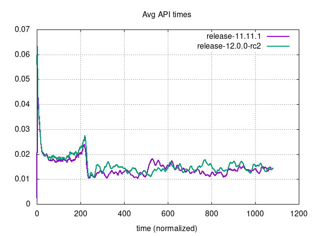     | 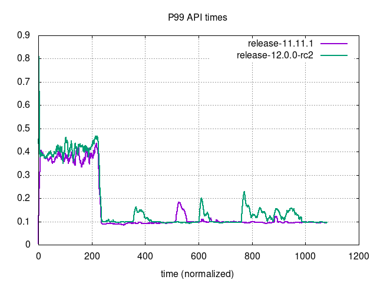                             |
|------------------------------------------------------------------------------------------|------------------------------------------------------------------------------------------------------------------|
| 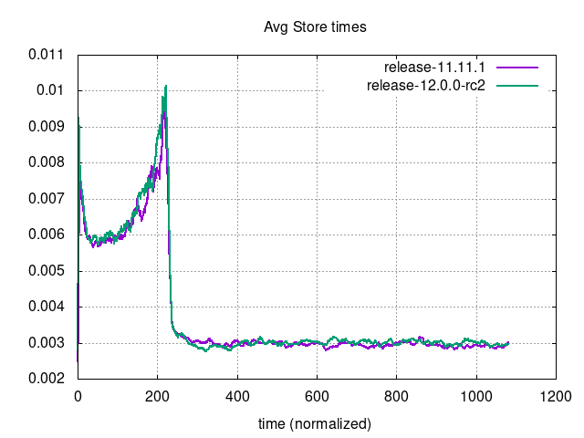 | 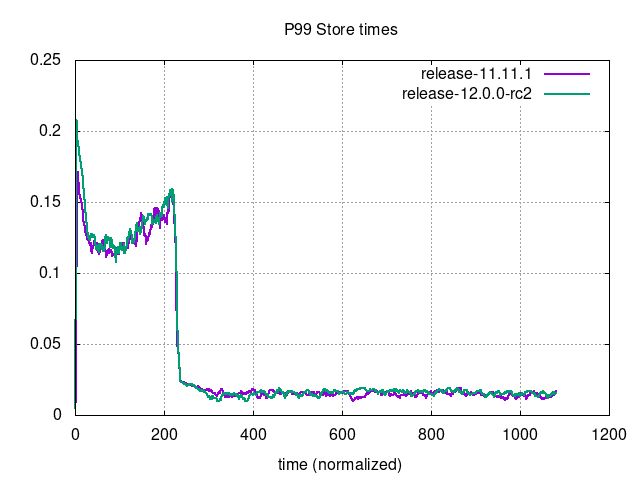                         |
| 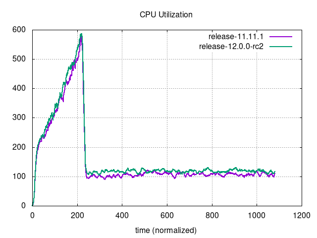 | 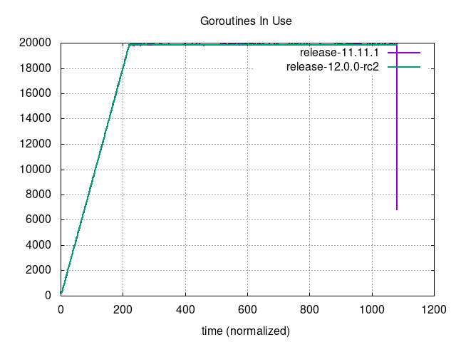                     |
| 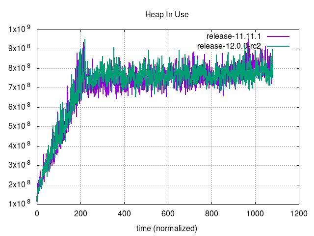         | 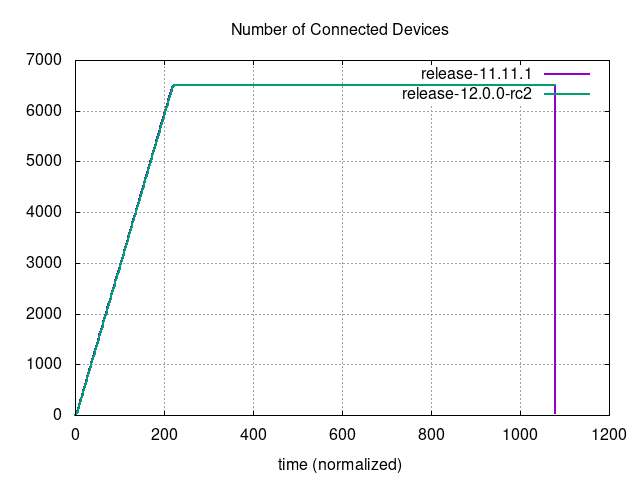 |
| 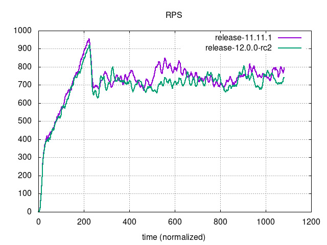                         | 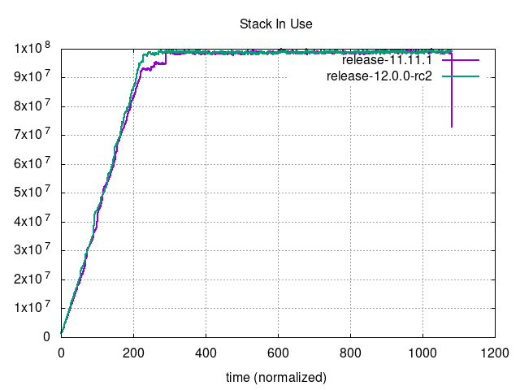                               |

### Graphs - Unbounded

| 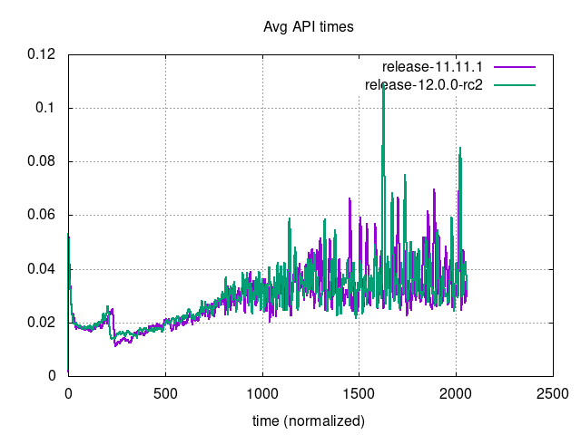     | 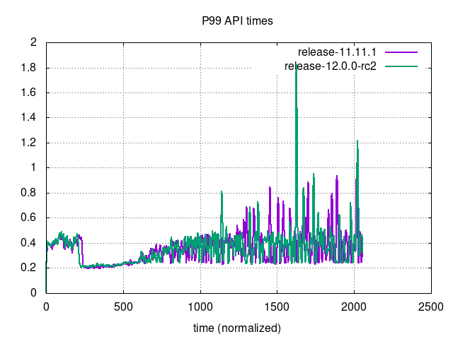                             |
|----------------------------------------------------------------------------------------------|----------------------------------------------------------------------------------------------------------------------|
| 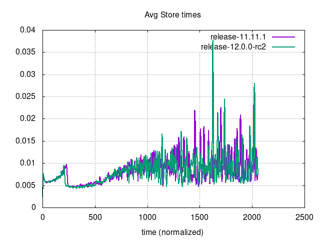 | 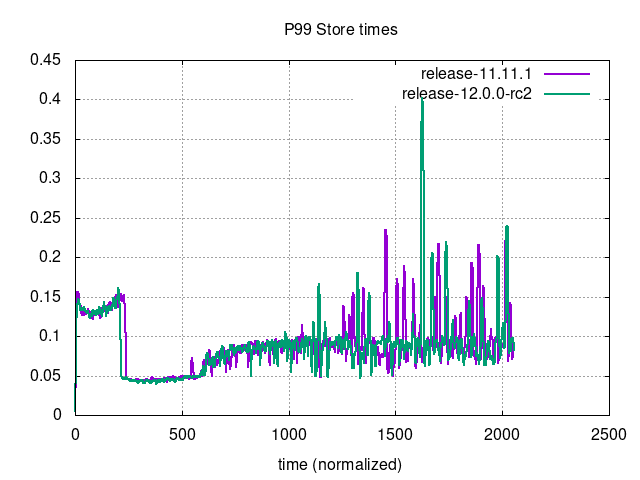                         |
| 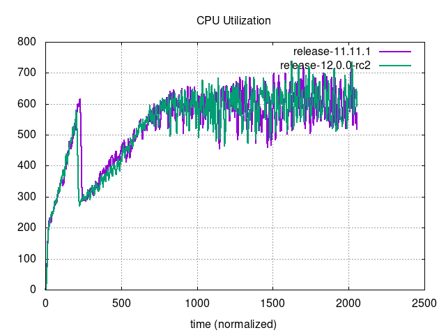 | 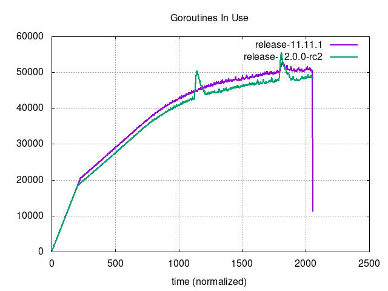                     |
| 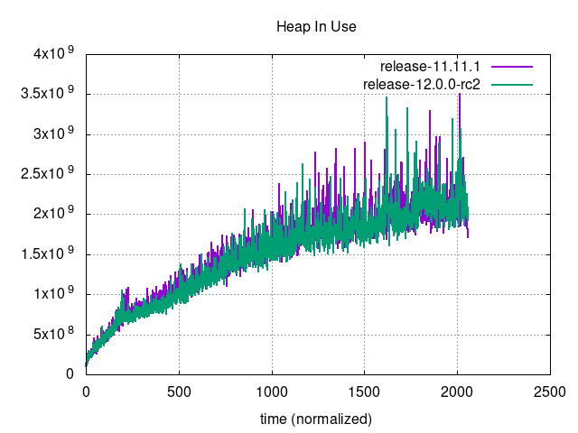         | 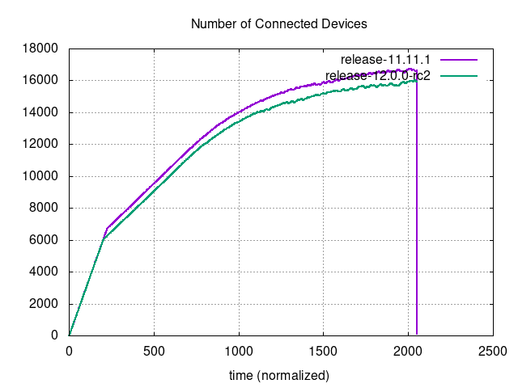 |
| 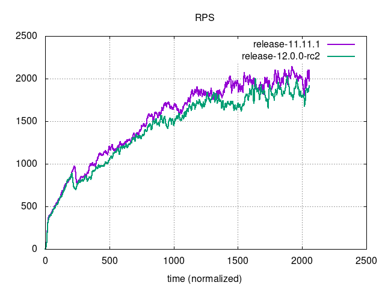                         | 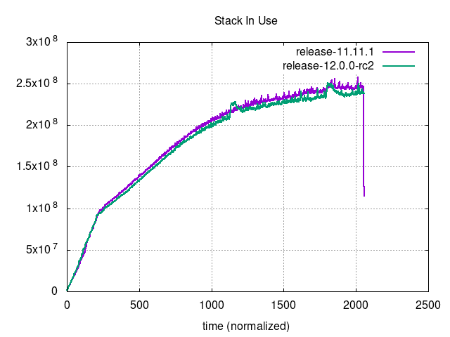                               |
