# Performance Comparison `v7.10.0` vs `v8.0.0-rc1`

## Comments

### Meta-analysis

  - This was the first comparison where we added a manual testing step to assess how slow or fast the clusters feel. This was performed by @dylan.haussermann. Results from this first test will follow.
  - The tests for this performance comparison suffered from four bugs that prevented the on-time analysis of the data. Namely:
      - Latest changes on both SSH restricted access and DB params: it made the first try of the performance comparison fail when deploying.
      - License bug: for a still unknown reason, one of the app nodes in some v8.0.0 builds failed to load the provided license, thus generating failures in the automated analysis.
      - Report bug: an out-of-range panic prevented the results of the latest run to being generated.
  - We had to run the performance comparison three times for this analysis:
      - Run 1 (all tests) - Regular comparison: Both Postgres bounded and MySQL unbounded failed with the license error; there was no time to do manual testing in the v8.0.0 tests.
      - Run 2 (all tests) - New run to try to fix errors in run 1, using [a new prod license](https://community.mattermost.com/private-core/pl/f4gcbxxwgi81zcxdtd7hfim4yc): Postgres unbounded failed with the same license error.
      - Run 3 (all tests but unbounded postgres; v8.0.0-RC1 was executed before v7.10.0) - New run to allow for manual testing in v8.0.0: Manual testing was possible, but the graphs, the dashboards and reports were not generated due to the report issue. Dashboards were manually generated afterwards, but not graphs.
  - The following table summarizes the validity of each test for each run, as well as the availability of generated graphs:

| Run | Postgres bounded | Postgres unbounded | MySQL bounded | MySQL unbounded | Graphs created |
|-----|------------------|--------------------|---------------|-----------------|----------------|
| 1   | ❌               | ✅                 | ✅            | ❌              | ✅             |
| 2   | ✅               | ❌                 | ✅            | ✅              | ✅             |
| 3   | ✅               | ❌                 | ✅            | ✅              | ❌             |

### Analysis

  - The number of supported users seems to have slightly increased in MySQL (run 1 reported an increase of 28.56%, while run 3 reported an increase of 5.21%). Postgres in run 2 reported a non-significant increase of 0.98%.
  - Heap in use was consistently larger in v7.10 than in v8.0 across all four tests. Stack in use was larger in v7.10 than in v8.0 in the bounded MySQL test. Running a diff view in Pyroscope does not help in the analysis, since most of the paths changed from `v6/` to `v8/` due to the module version bump (see screenshot below). A more thorough analysis cleaning the input data to match `v6` paths to `v8` paths would be needed.

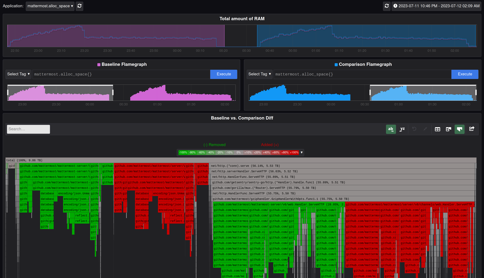

## Next Steps

  - Fix the various bugs identified:
      - [Restricted SSH access to a single IP](https://mattermost.atlassian.net/browse/MM-53558)
      - [Non-idempotency of the DB params](https://mattermost.atlassian.net/browse/MM-53560)
      - [License upload failures](https://mattermost.atlassian.net/browse/MM-53597)
      - [Panic during report](https://mattermost.atlassian.net/browse/MM-53644)
  - Polish the process to make manual testing less stressful (automated start of all tests make scheduling hard) and less error-prone (defining when and what to test is key): <https://mattermost.atlassian.net/browse/MM-53645>
  - Define a test and release process for the load-test repo, and use only tested versions in the comparisons: <https://mattermost.atlassian.net/browse/MM-53646>

## Setup

| Setting                              | Value                                                                                                        |
| ------------------------------------ | ------------------------------------------------------------------------------------------------------------ |
| Load-test version                    | Custom build: [perf.comp.v8 branch](https://github.com/mattermost/mattermost-load-test-ng/tree/perf.comp.v8) |
| Dataset                              | DB dump from `v6.1.0` with 12M posts                                                                         |
| Bounded - number of users (Postgres) | 7500                                                                                                         |
| Bounded - number of users (MySQL)    | 5000                                                                                                         |
| Bounded - duration                   | 90 minutes                                                                                                   |
| Unbounded - `MaxActiveUsers`         | 20000                                                                                                        |
| Unbounded - num of users per agent   | 2000                                                                                                         |
| App instances                        | 2 x c5.2xlarge                                                                                               |
| Agent instances                      | 11 x c5.xlarge                                                                                               |
| Proxy Instance                       | 1 x c5.xlarge                                                                                                |
| DB instances                         | 2 x db.r6g.2xlarge                                                                                           |

## Results

### Grafana

Run 1 was overwritten with run 2, so there are no Grafana dashboards of that run, only from runs 2 and 3 (manually generated due to the report bug).

#### Run 2
    
- [Bounded - MySQL](https://snapshots.raintank.io/dashboard/snapshot/6JY6P2SBLzMcNXGxBqYnPD4m7pHSsbj0)
- [Bounded - Postgres](https://snapshots.raintank.io/dashboard/snapshot/TeM4X9FctX6UOZOsGki1mQ904QkkfBOP)
- [Unbounded - MySQL](https://snapshots.raintank.io/dashboard/snapshot/4YOpWkT2AQw81rTBPy9Wz7Lb5z23b1dv)
- [Unbounded - Postgres](https://snapshots.raintank.io/dashboard/snapshot/373DxOy11rsFENvKn2jdHWwadGbvRTxh) (affected by license bug)

#### Run 3
    
- [Bounded - MySQL](https://snapshots.raintank.io/dashboard/snapshot/r5SrFR61wkdFD7G113ar6r0gmbft4Iii)
- [Bounded - Postgres](https://snapshots.raintank.io/dashboard/snapshot/R2IPWgkOEJc2uWKqL5LjgN5Er7HUef48)
- [Unbounded - MySQL](https://snapshots.raintank.io/dashboard/snapshot/e86ltgq5b46LxUoebLYF5NDSKWWt0Ntu)

### Number of errors

| Test                       | v7.10.0 | v8.0.0-RC1 | Delta    |
| -------------------------- | ------- | ---------- | -------- |
| Bounded MySQL (run 1)      | 3141    | 3257       | 3.69%    |
| Bounded Postgres (run 2)   | 3576    | 3023       | \-15.46% |
| Unbounded MySQL (run 2)    | 154625  | 136321     | \-11.84% |
| Unbounded Postgres (run 1) | 141753  | 159957     | 12.84%   |

### Supported users in unbounded tests

MySQL unbounded was tested in both runs 1 and 3, so both results are
reflected in the table.

| Test             | v7.10.0 | v8.0.0-rc1 | Delta  |
| ---------------- | ------- | ---------- | ------ |
| MySQL (run 1)    | 15489   | 19913      | 28.56% |
| MySQL (run 3)    | 15476   | 16283      | 5.21%  |
| Postgres (run 2) | 17664   | 17837      | 0.98%  |

### Graphs - Bounded MySQL

####  Run 1
    
| 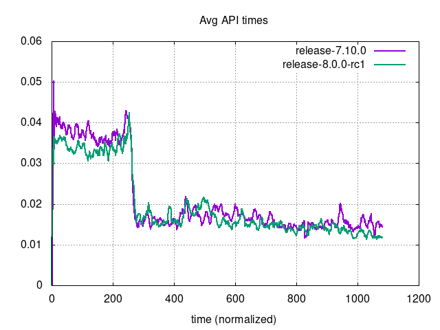     | 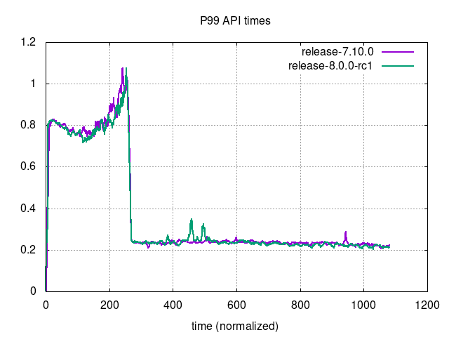                             |
|--------------------------------------------------------------------------------|--------------------------------------------------------------------------------------------------------|
|  | 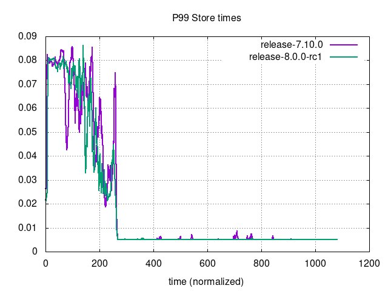                         |
| 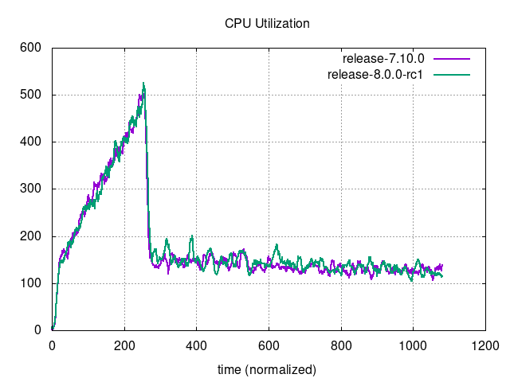 | 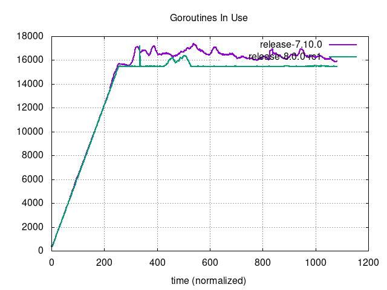                     |
| 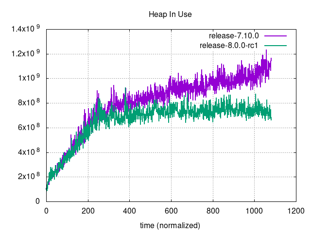         |  |
| 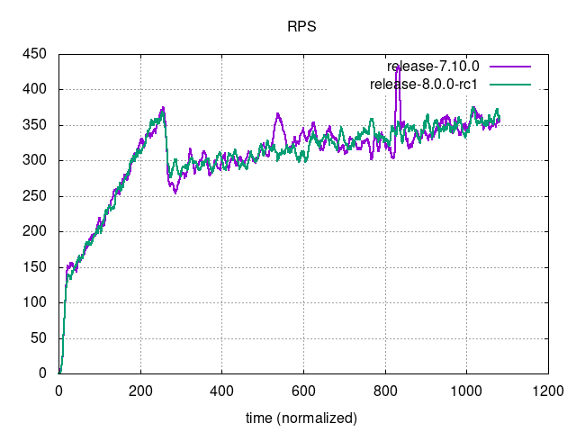                         | 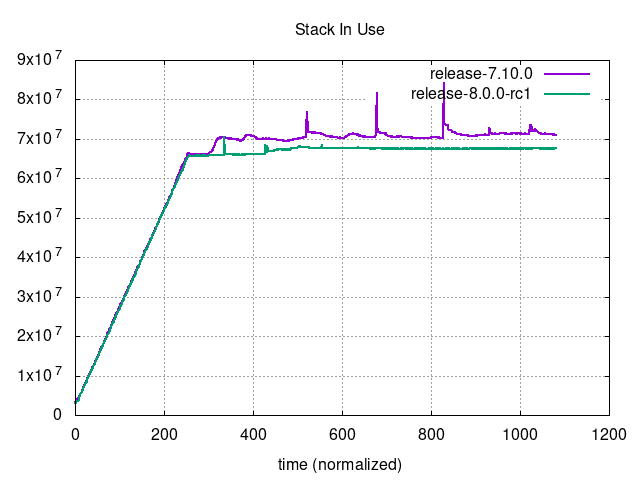                               |
    

####  Run 2
    
|      |                              |
|--------------------------------------------------------------------------------|--------------------------------------------------------------------------------------------------------|
|  |                          |
|  |                      |
|          |  |
|                          |                                |
    

### Graphs - Bounded Postgres

####  Run 1
    
Failed

####  Run 2
    
|      | 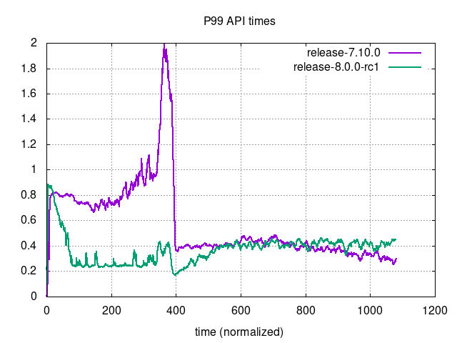                             |
|------------------------------------------------------------------------------------------|------------------------------------------------------------------------------------------------------------------|
|  | 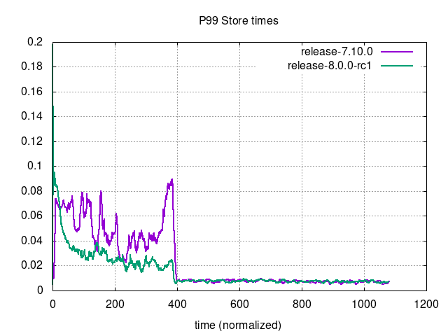                         |
| 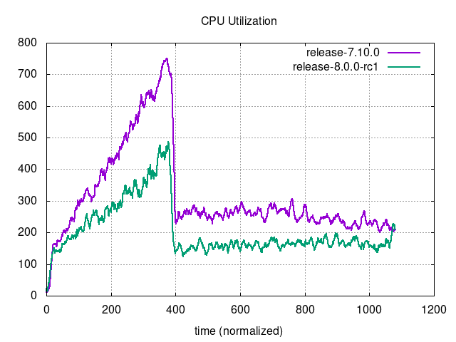 | 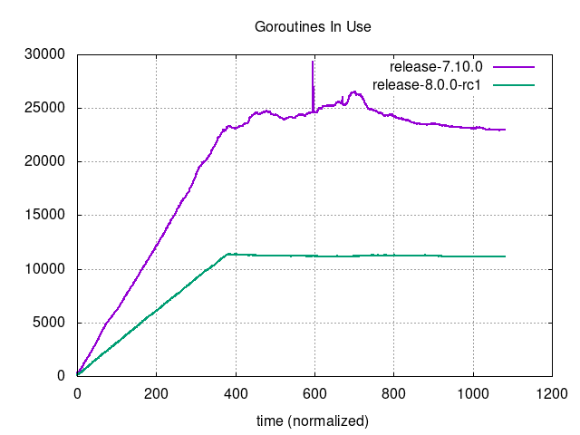                     |
| 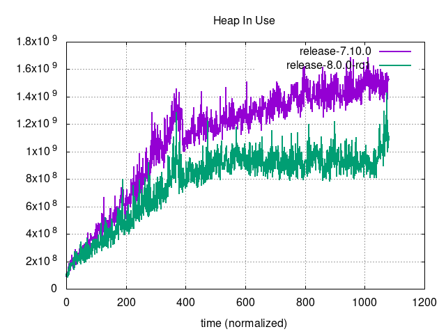         |  |
| 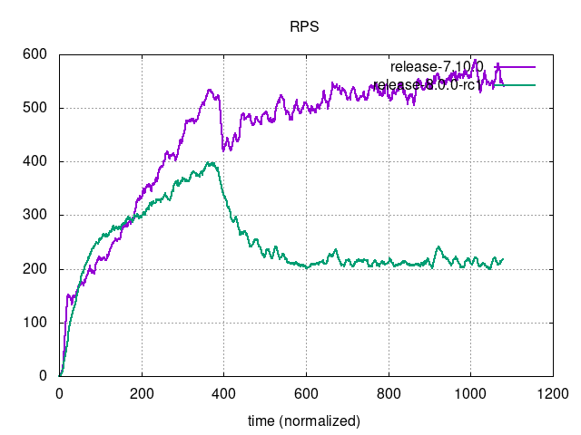                         | 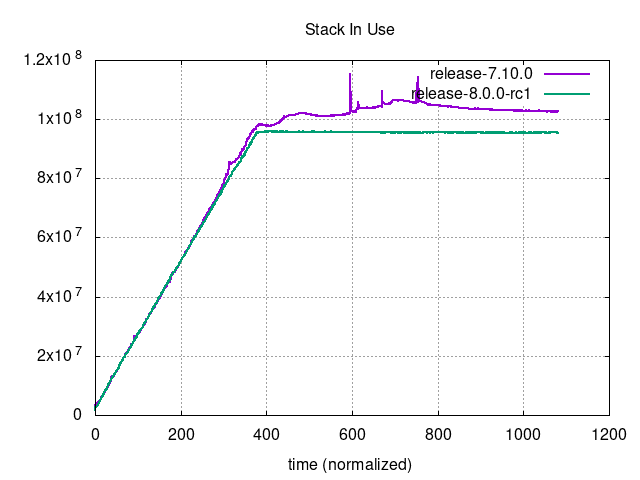                               |
    

### Graphs - Unbounded MySQL

####  Run 1
    
Failed

####  Run 2
    
| 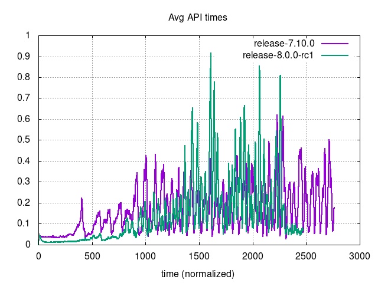     |                              |
|------------------------------------------------------------------------------------|------------------------------------------------------------------------------------------------------------|
| 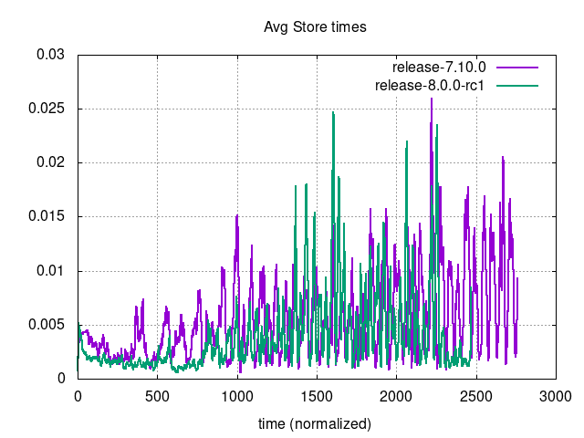 | 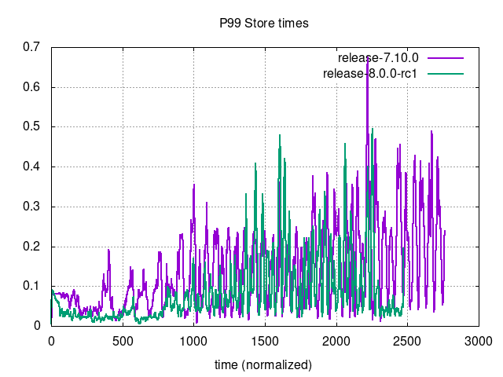                         |
| 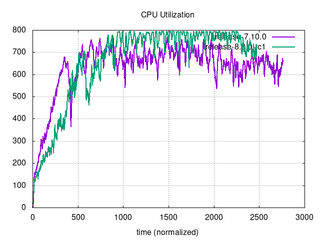 | 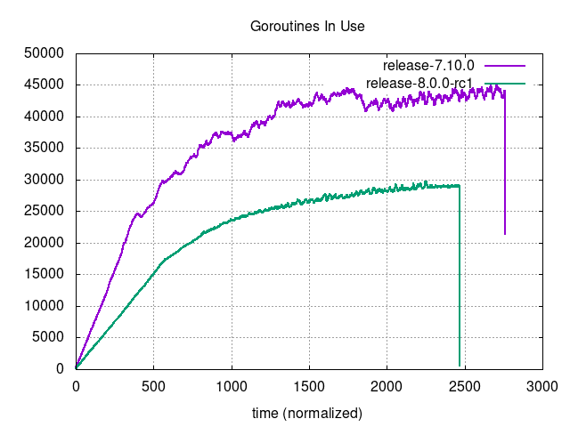                     |
| 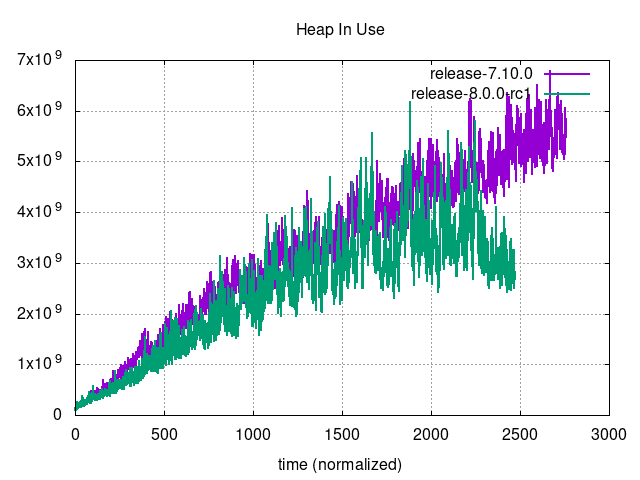         | 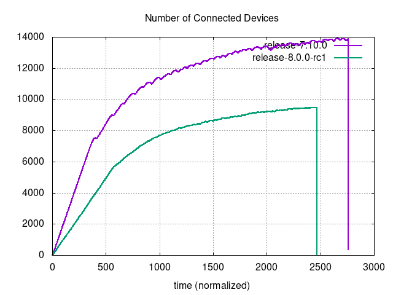 |
| 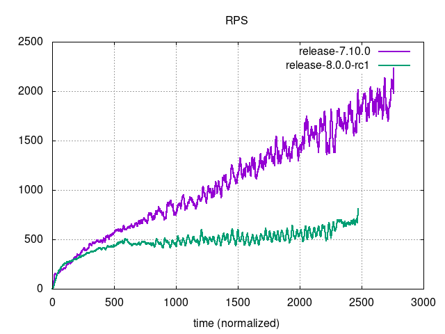                         | 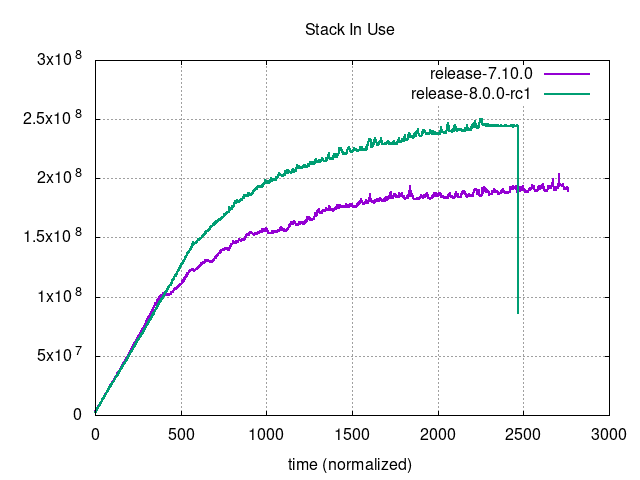                               |
    

### Graphs - Unbounded Postgres

#### Run 1
    
| 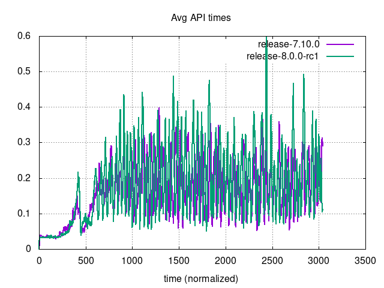     | 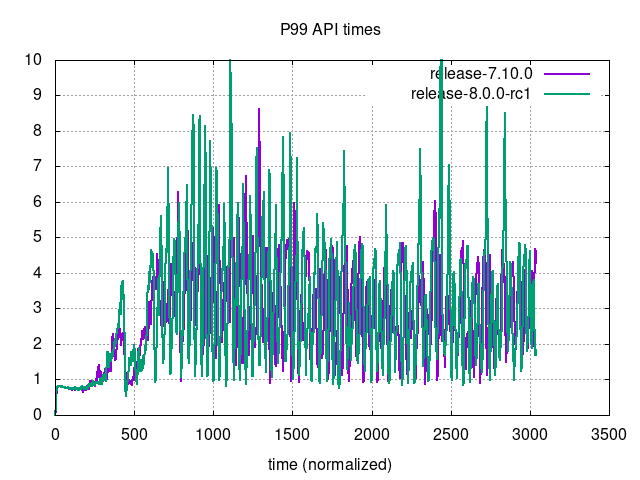                             |
|----------------------------------------------------------------------------------------------|----------------------------------------------------------------------------------------------------------------------|
| 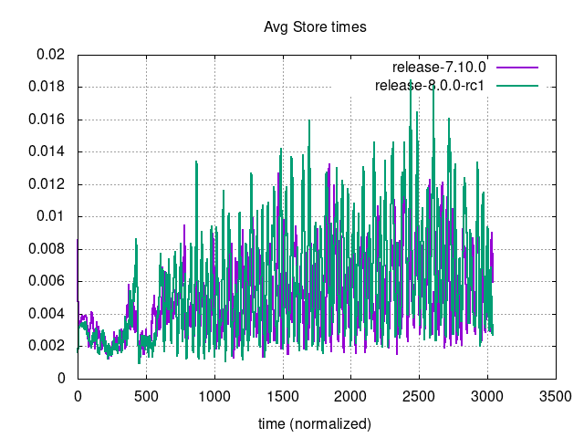 |                          |
| 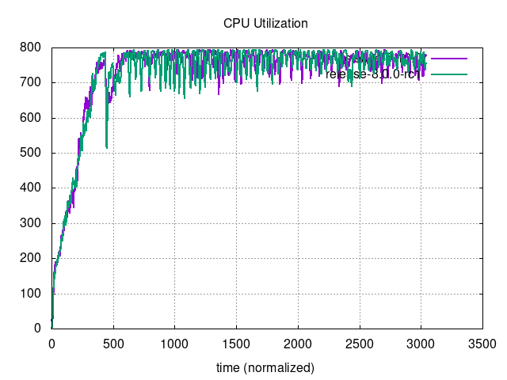 | 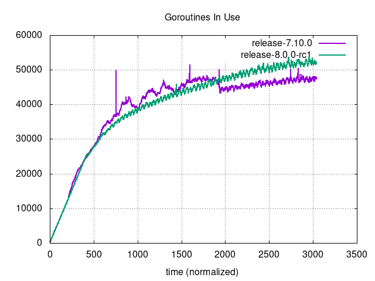                     |
| 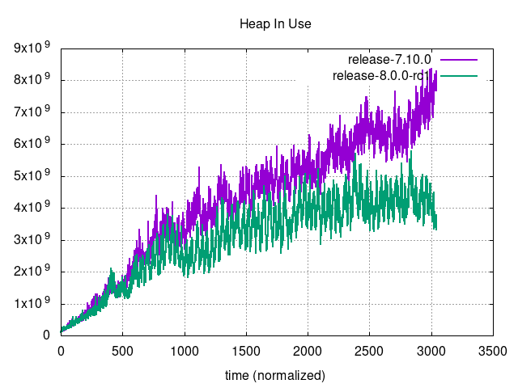         | 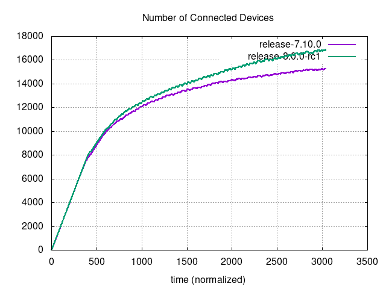 |
| 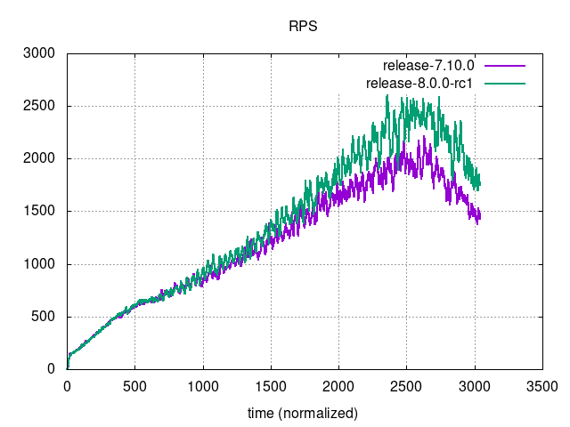                         | 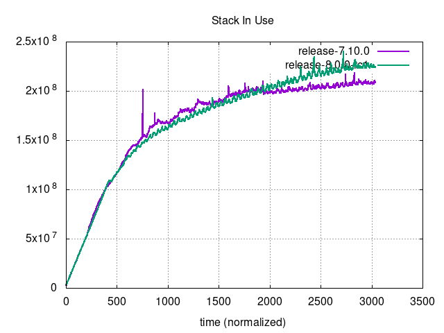                               |
    

####  Run 2
    
Failed
