# Performance Comparison `v8.0.1` vs `v8.1.0-rc1`

## Comments

- The servers, both v8.0.1 and v8.1.0-rc1 have been patched with [a commit](https://github.com/mattermost/mattermost/commit/677c3ae6f68c7da369c720668aa7f1c5533892a3) fixing [the LoadLicense issues](https://mattermost.atlassian.net/browse/MM-53879).
- No significant differences in the number of supported users (a difference of +0.59% for MySQL and of -0.01% for PostgreSQL).
- No evident changes in the API times nor in the store times.
- There's a somewhat significant difference between builds in the stack in use \[Note 1\]:
  - For MySQL, the stack in use for the new build is larger: between +6.72% and 11.20% during the stable phase.
  - For PostgreSQL, the stack in use for the new build is smaller: between -5.03% and -8.05% during the stable phase.
- There is not a significant difference between builds in the heap in use \[Note 2\]:
  - For MySQL, the heap in use for the new build is in average larger, but just a +0.0361%.
  - For PostgreSQL, the heap in use for the new build is in average larger, but just a +0.213%.
  - These differences show up as just noise in the diff view from Pyroscope.

Note 1: `(100 * sum(go_memstats_stack_inuse_bytes{instance=~"app.*:8067"}) / sum(go_memstats_stack_inuse_bytes{instance=~"app.*:8067"} offset 6459s)) - 100`
Note 2: `(100 * sum(sum_over_time(go_memstats_heap_inuse_bytes{instance=~"app.*:8067"}[50m])) / sum(sum_over_time(go_memstats_heap_inuse_bytes{instance=~"app.*:8067"}[50m] offset 6459s))) - 100`

## Next Steps

- Discuss the stack differences with the team and decide next steps if any.

## Setup

| Setting                              | Value                                                                                                                                                                                                                       |
| ------------------------------------ | --------------------------------------------------------------------------------------------------------------------------------------------------------------------------------------------------------------------------- |
| Load-test version                    | Branch [perf.comp.v8.1](https://github.com/mattermost/mattermost-load-test-ng/tree/perf.comp.v8.1), commit [b006b72](https://github.com/mattermost/mattermost-load-test-ng/commit/b006b72663f30f6098ec08bd7bb33236884227fb) |
| Dataset                              | DB dump from `v6.1.0` with 12M posts                                                                                                                                                                                        |
| Bounded - number of users (Postgres) | 7500                                                                                                                                                                                                                        |
| Bounded - number of users (MySQL)    | 5000                                                                                                                                                                                                                        |
| Bounded - duration                   | 90 minutes                                                                                                                                                                                                                  |
| Unbounded - `MaxActiveUsers`         | 20000                                                                                                                                                                                                                       |
| Unbounded - num of users per agent   | 2000                                                                                                                                                                                                                        |
| App instances                        | 2 x c5.2xlarge                                                                                                                                                                                                              |
| Agent instances                      | 11 x c5.xlarge                                                                                                                                                                                                              |
| Proxy Instance                       | 1 x c5.xlarge                                                                                                                                                                                                               |
| DB instances                         | 2 x db.r6g.2xlarge                                                                                                                                                                                                          |

## Results

### Grafana (Raintank snapshots)

  - [Unbounded - Postgres](https://snapshots.raintank.io/dashboard/snapshot/dUiZZ3FRRBV4gCLV042qQduGrFDc3Rp6)
  - [Bounded - Postgres](https://snapshots.raintank.io/dashboard/snapshot/VV61LCCQUsp28n1Ppp8xLm7RvCtf08dj)
  - [Unbounded - MySQL](https://snapshots.raintank.io/dashboard/snapshot/RnteHqdg0Tw7ehX75gml6o54QQb414as)
  - [Bounded - MySQL](https://snapshots.raintank.io/dashboard/snapshot/XlI4XkQ6ioAv86TtPnl26RUw5rMj0XNK)

### Number of errors

| Test               | v8.0.1 | v8.1.0-rc1 | Delta   |
| ------------------ | ------ | ---------- | ------- |
| Bounded MySQL      | 5073   | 5177       | 2.05%   |
| Bounded Postgres   | 5850   | 5838       | \-0.21% |
| Unbounded MySQL    | 219488 | 232991     | 6.15%   |
| Unbounded Postgres | 279670 | 262349     | \-6.19% |

### Supported users in unbounded tests

| Test     | v8.0.1 | v8.1.0-rc1 | Delta   |
| -------- | ------ | ---------- | ------- |
| MySQL    | 18158  | 18266      | 0.59%   |
| Postgres | 19906  | 19904      | \-0.01% |

### Graphs - Bounded MySQL

|      | 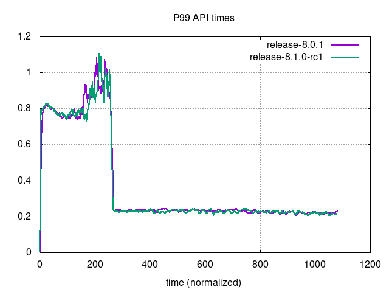                             |
|--------------------------------------------------------------------------------|--------------------------------------------------------------------------------------------------------|
| 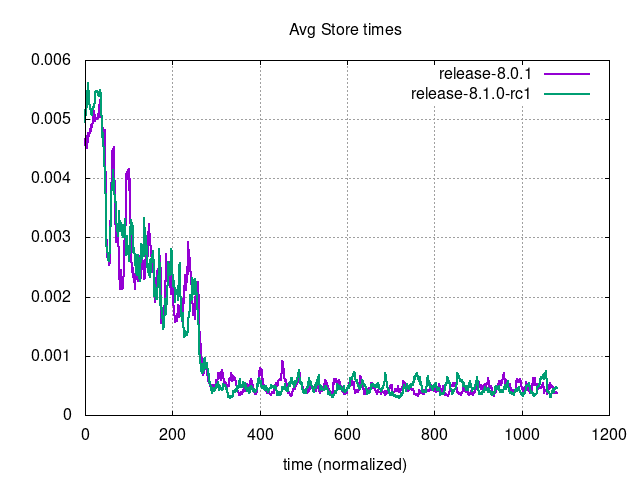 | 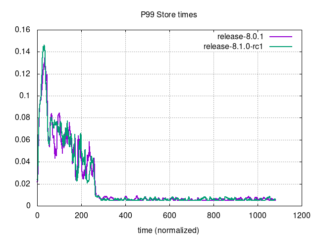                         |
| 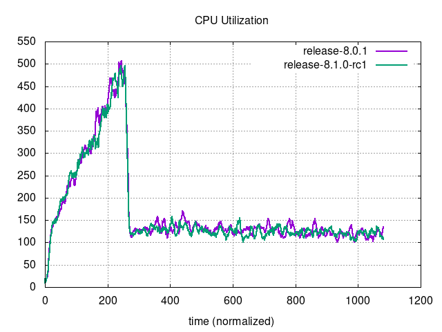 | 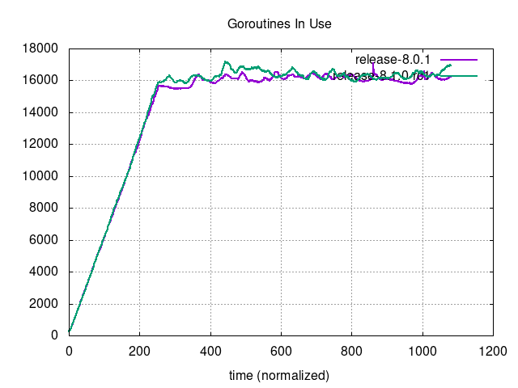                     |
| 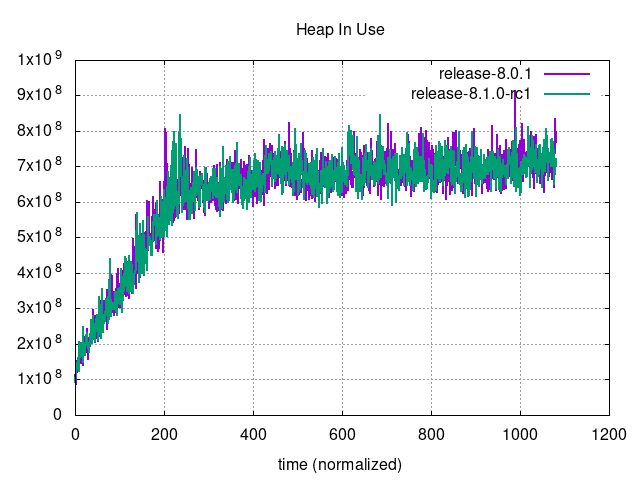         | 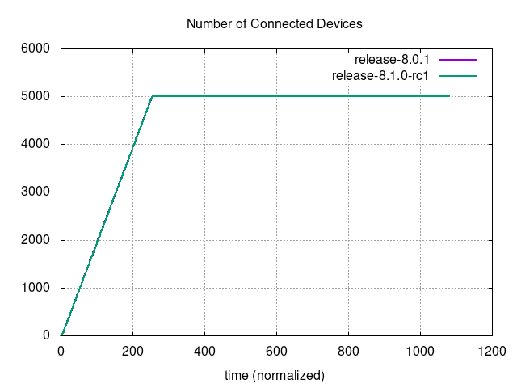 |
|                          | 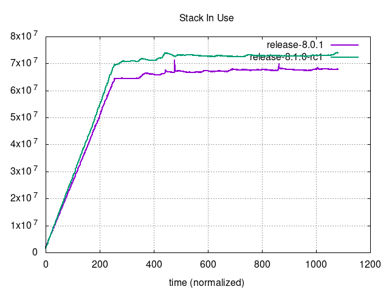                               |

### Graphs - Bounded Postgres

| 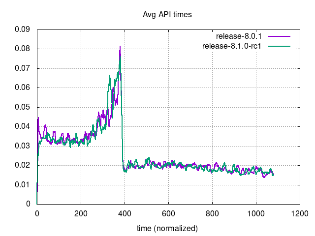     | 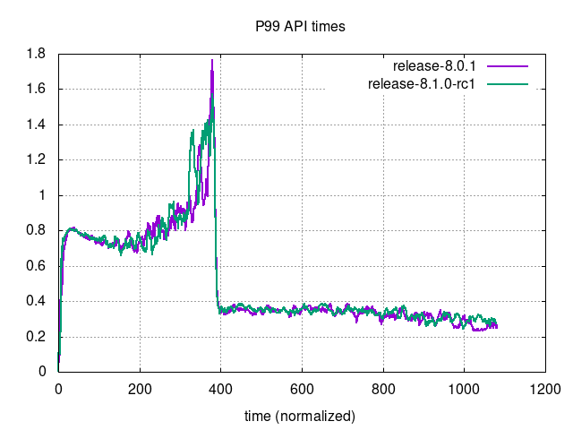                             |
|------------------------------------------------------------------------------------------|------------------------------------------------------------------------------------------------------------------|
| 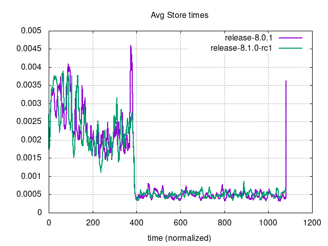 | 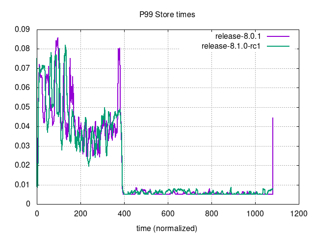                         |
|  |                      |
| 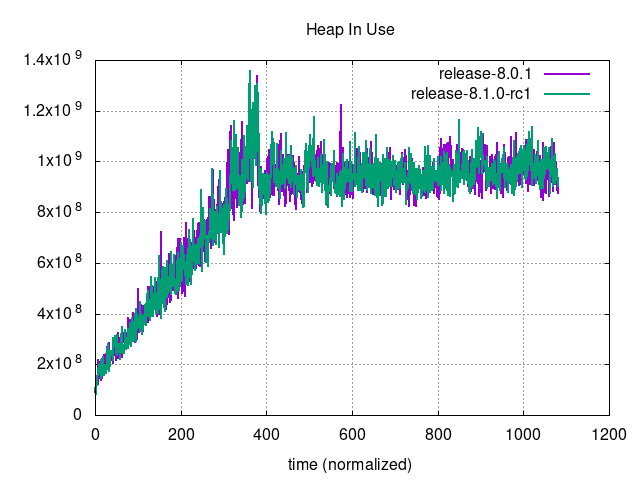         |  |
| 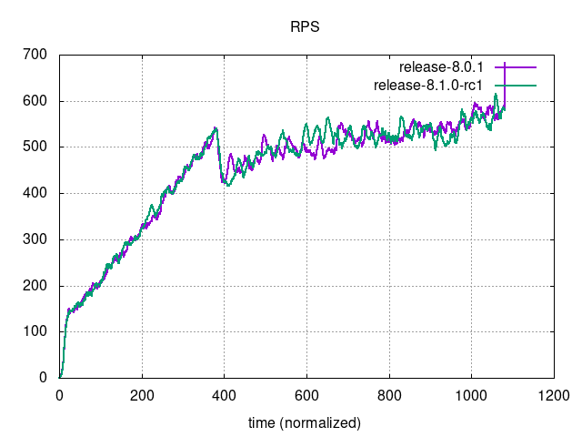                         | 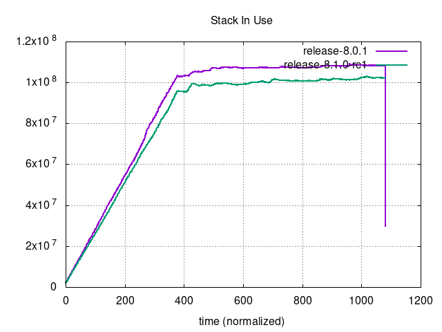                               |

### Graphs - Unbounded MySQL
    
| 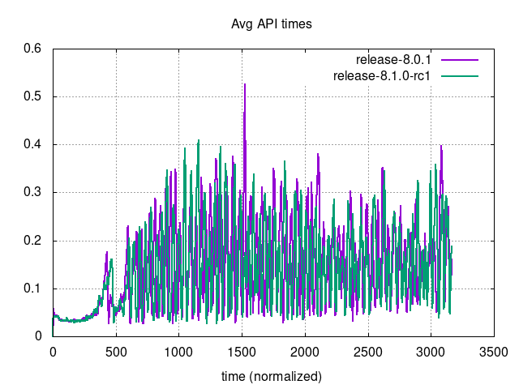     |                              |
|------------------------------------------------------------------------------------|------------------------------------------------------------------------------------------------------------|
| 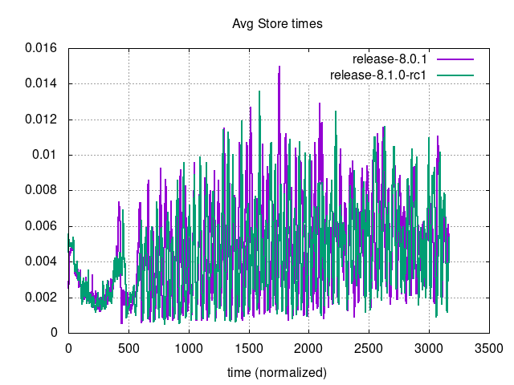 | 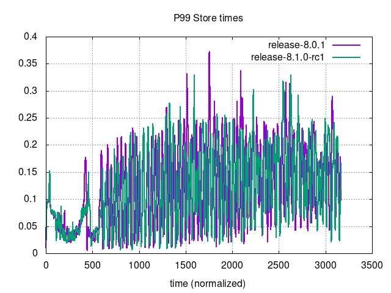                         |
| 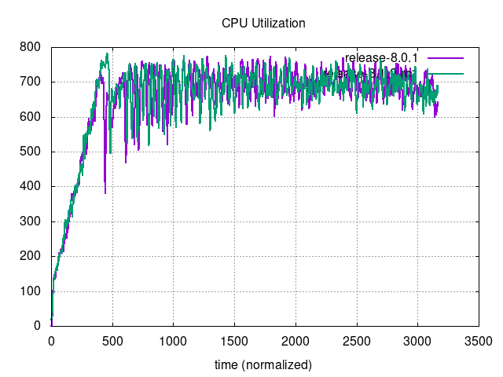 |                      |
|          | 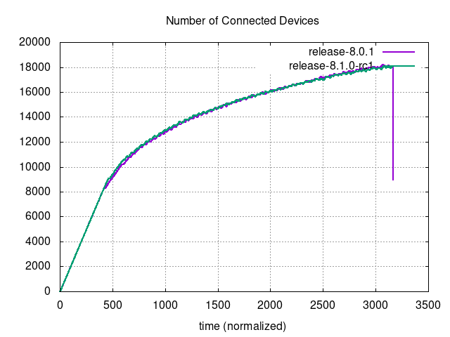 |
| 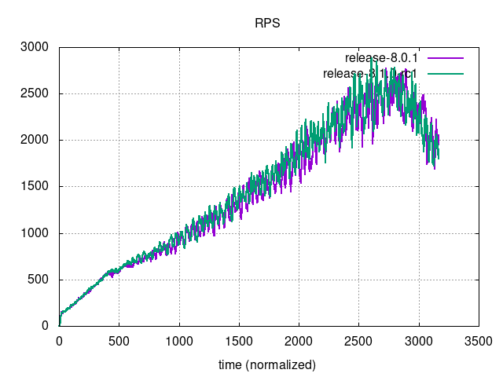                         |                                |

### Graphs - Unbounded Postgres

| 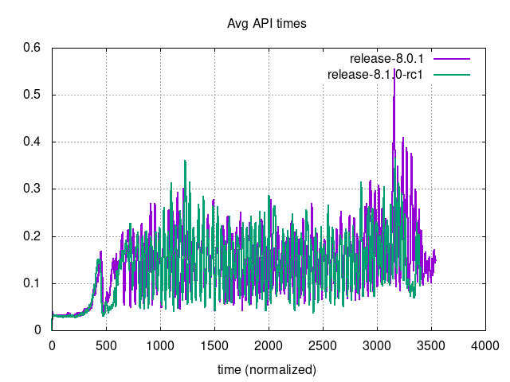     | 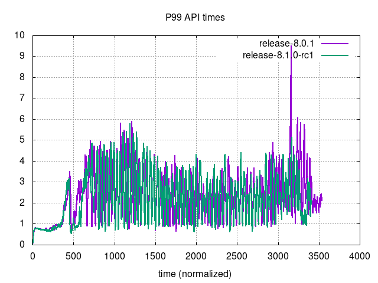                             |
|----------------------------------------------------------------------------------------------|----------------------------------------------------------------------------------------------------------------------|
| 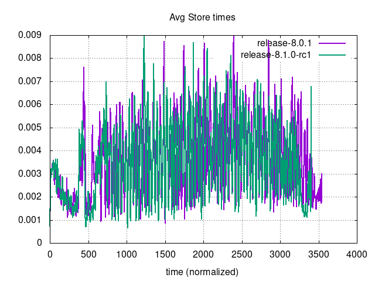 | 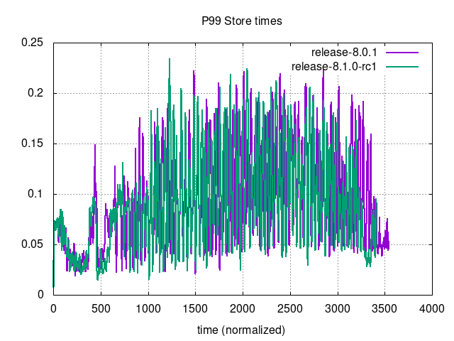                         |
| 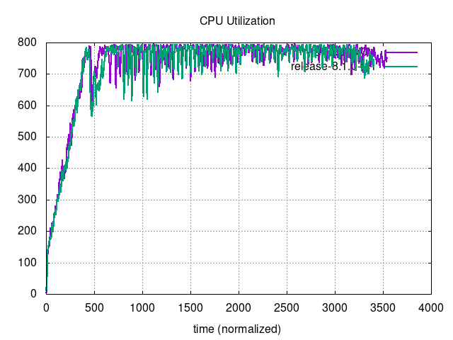 | 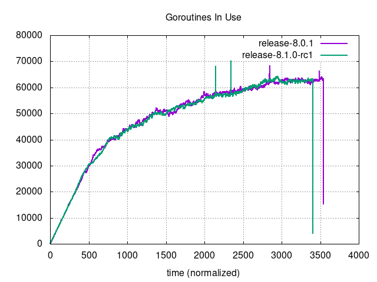                     |
| 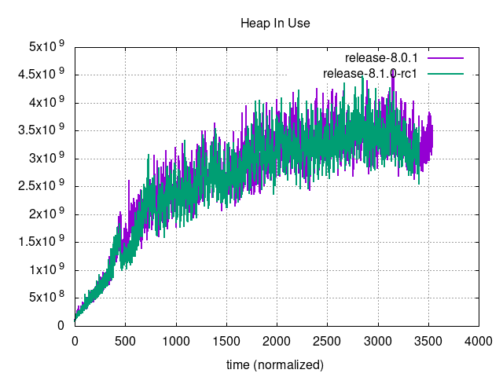         | 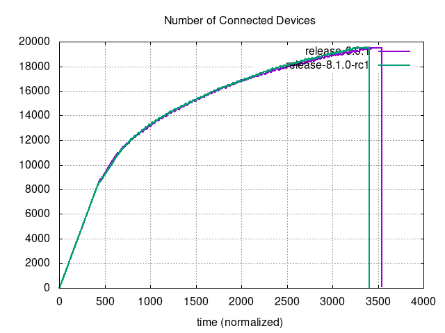 |
| 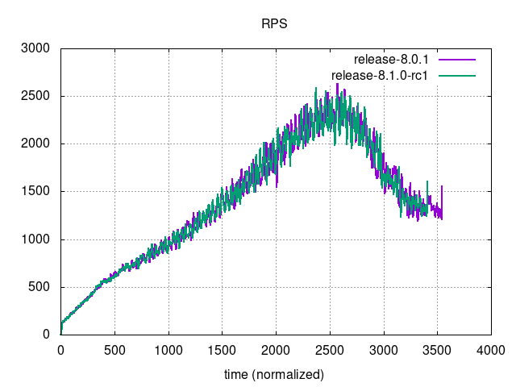                         | 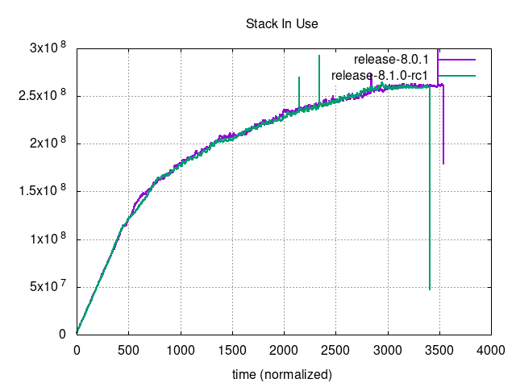                               |
