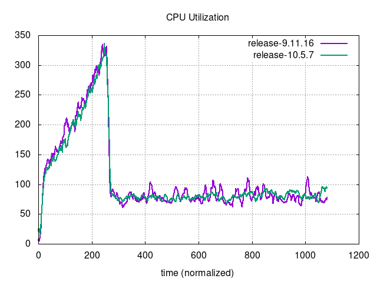
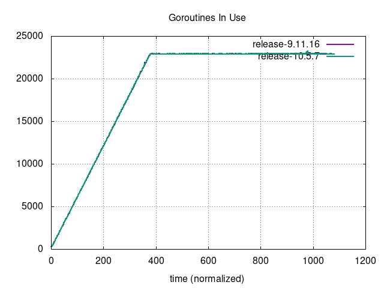

# Ad-hoc Performance Comparison `v9.11.16` vs `v10.5.7`

## Comments

### Methodology

- This is an ad-hoc investigation on the performance comparison between v9.11 and v10.5.
- The first runs were executed using [v1.27.0](https://github.com/mattermost/mattermost-load-test-ng/releases/tag/v1.27.0) of the load-test tool, but some bugs were found in the way, which made us run a [custom, patched branch](https://github.com/mattermost/mattermost-load-test-ng/tree/patched.release-1.27) of the tool:
  - Apart from two other minor bugs, the main change in this branch was a modification to [increase the size of the receive ring buffer on the network card](https://github.com/mattermost/mattermost-load-test-ng/commit/54631637b8ed458b257165983d183301157eb3e1). The old size had proven to make the tests flaky, returning different results each time. Once this change was introduced, the next runs were fully stable.
- The tests with the patched branch were still ran two times, to rule out any inconsistencies.

### Analysis

The first runs, previous to the ring buffer change, were dominated by the coordinator metric on TCP retransmissions in the app nodes, meaning that the network card (in the receiving end of the proxy instance) was overwhelmed with traffic bursts that outsized the buffer, resulting in lost packets that had to be retransmitted. This made the tests quite flaky: due to the random nature of the tool, traffic bursts can happen at any moment. Having an undersized buffer end up making the threshold of this coordinator metric happy to be crossed, thus making the coordinator converge earlier than we would have expected.


Once this was understood, we saw that we were actually underutilizing the proxy AWS instance, a `c7i.xlarge`, whose hardware permitted a buffer larger than the size we had configured:

    ubuntu@ip-172-27-60-19:~$ sudo ethtool -g enp39s0
    Ring parameters for enp39s0:
    Pre-set maximums:
    RX:             8192
    RX Mini:        n/a
    RX Jumbo:       n/a
    TX:             1024
    Current hardware settings:
    RX:             1024
    RX Mini:        n/a
    RX Jumbo:       n/a
    TX:             1024

The buffer permits an RX ring buffer size of 8192, while we were using 1024. This was easily fixed by running the following command:

``` bash
sudo ethtool -G enp39s0 rx 8192
```

which made use of the full hardware potential:

    ubuntu@ip-172-27-207-14:~$ sudo ethtool -g enp39s0
    Ring parameters for enp39s0:
    Pre-set maximums:
    RX:             8192
    RX Mini:        n/a
    RX Jumbo:       n/a
    TX:             1024
    Current hardware settings:
    RX:             8192
    RX Mini:        n/a
    RX Jumbo:       n/a
    TX:             1024

When we repeated the tests with this fix, the metric that dominated the metric was no longer the TCP retransmissions, which was virtually zero, but the CPU usage of the app:


In this state, the tests were way more stable, returning the results explained in the following section.

### Results

- The comparison among versions is favourable to v10.5.7 in both MySQL and PostgreSQL:
  - For MySQL, v10.5.7 can support between 9.22% and 12.84% more users than v9.11.16.
  - For PostgreSQL, v10.5.7 can support between 7.76% and 11.23% more users than v9.11.16.
- The comparison among databases is favourable to PostgreSQL in both v9.11.16 and v10.5.7:
  - For v9.11.16, PostgreSQL can support between 5.88% and 7.37% more users than MySQL.
  - For v10.5.7, PostgreSQL can support between 4.47% and 5.84% more users than MySQL.

## Action Items

- Make the receive ring buffer change production-ready and backport it to v1.27: [MM-64590](https://mattermost.atlassian.net/browse/MM-64590).

## Setup

| Setting                              | Value                                                                                                                                                                                      |
| ------------------------------------ | ------------------------------------------------------------------------------------------------------------------------------------------------------------------------------------------ |
| Load-test version                    | [`Patched v1.27.0`](https://github.com/mattermost/mattermost-load-test-ng/tree/patched.release-1.27)                                                                                       |
| Dataset                              | Dump from `v6.1.0`, 12M posts ([postgres](https://lt-public-data.s3.amazonaws.com/12M_610_fixed_psql.sql.gz), [mysql](https://lt-public-data.s3.amazonaws.com/12M_610_fixed_mysql.sql.gz)) |
| Bounded - number of users (Postgres) | 7500                                                                                                                                                                                       |
| Bounded - number of users (MySQL)    | 5000                                                                                                                                                                                       |
| Bounded - duration                   | 90 minutes                                                                                                                                                                                 |
| Unbounded - MaxActiveUsers           | 20000                                                                                                                                                                                      |
| Unbounded - num of users per agent   | 2000                                                                                                                                                                                       |
| App instances                        | 2 x c7i.2xlarge                                                                                                                                                                            |
| Agent instances                      | 11 x c7i.xlarge                                                                                                                                                                            |
| Proxy Instance                       | 1 x c7i.xlarge                                                                                                                                                                             |
| DB instances                         | 2 x db.r7g.2xlarge                                                                                                                                                                         |

## Results

### Grafana

These are snapshots of the original Grafana dashboards.

#### Run 1
    
- Postgres unbounded:
  - [System metrics](https://snapshots.raintank.io/dashboard/snapshot/oSSPtni9MajJiCkJNC7uRzpRN88xcEde)
  - [Coordinator metrics](https://snapshots.raintank.io/dashboard/snapshot/6JM1QNKYI4Qkosm9hKngPDESGpkBppyn)
- Postgres bounded:
  - [System metrics](https://snapshots.raintank.io/dashboard/snapshot/YYnAWm0rgnYLrTFzFpuRCRAuQPumnDeV)
  - [Coordinator metrics](https://snapshots.raintank.io/dashboard/snapshot/grv2mnyuYTTF6BifEAC31j97nOu9ZDbs)
- MySQL unbounded:
  - [System metrics](https://snapshots.raintank.io/dashboard/snapshot/IvdyAiu9R7dJaVMER7TzUxUzdOUE336E)
  - [Coordinator metrics](https://snapshots.raintank.io/dashboard/snapshot/Cj12F7tt6i0qDp4n9IyO73xxcpK8Ljfa)
- MySQL bounded:
  - [System metrics](https://snapshots.raintank.io/dashboard/snapshot/6RD5r4YQhQ2noOCqPgNkLvZ6zUneaIbl)
  - [Coordinator metrics](https://snapshots.raintank.io/dashboard/snapshot/GdErVGF7HydMHX40DQqoNAvqJrnhd7yf)

#### Run 2
    
- Postgres unbounded:
  - [System metrics](https://snapshots.raintank.io/dashboard/snapshot/V2EIL5BmEQHyVe8CjRmK2FM7xyfiQ1d8)
  - [Coordinator metrics](https://snapshots.raintank.io/dashboard/snapshot/xwJXnBVqXpB7OjRrNjwfUE0c4ER8k1D3)
- Postgres bounded:
  - [System metrics](https://snapshots.raintank.io/dashboard/snapshot/ipYIvbiAglQIy7VaRqsaHEToJcdT02KM)
  - [Coordinator metrics](https://snapshots.raintank.io/dashboard/snapshot/Jo8RjbLyvgnXZfs1wGxR8Yju19CaPjwu)
- MySQL unbounded:
  - [System metrics](https://snapshots.raintank.io/dashboard/snapshot/bHmgykotYAQLZmBM48s7aIn87RltfpfB)
  - [Coordinator metrics](https://snapshots.raintank.io/dashboard/snapshot/f7fLtQ7L14QZRPlFpYWXaaonkEz1xtnK)
- MySQL bounded:
  - [System metrics](https://snapshots.raintank.io/dashboard/snapshot/fa9FkKrIfmjPJFBAtNqlnQTEDW5FOLe7)
  - [Coordinator metrics](https://snapshots.raintank.io/dashboard/snapshot/7JeN9mmaX0ivcunop4H3LH1tdUBhQKPV)

### Supported users in unbounded tests

####  Run 1
    
| Test     | v9.11.16 | v10.5.7 | Delta  |
| -------- | -------- | ------- | ------ |
| MySQL    | 14186    | 16007   | 12.84% |
| Postgres | 15232    | 16942   | 11.23% |
| Delta    | 7.37%    | 5.84%   |        |
    

####  Run 2
    
| Test     | v9.11.16 | v10.5.7 | Delta |
| -------- | -------- | ------- | ----- |
| MySQL    | 14989    | 16371   | 9.22% |
| Postgres | 15870    | 17102   | 7.76% |
| Delta    | 5.88%    | 4.47%   |       |
    

### Graphs

#### Run 1

##### Bounded MySQL


|  |  |
| --- | ---|
|  |  |
|  |  |
|  |  |
|  |  |

##### Bounded Postgres

|  |  |
| --- | ---|
|  |  |
|  |  |
|  |  |
|  |  |

##### Unbounded MySQL

|      |                              |
| --- | --- |
|  |                          |
|  |                      |
|          |  |
|                          |                                |


##### Unbounded Postgres

|      |                              |
| --- | ---|
|  |                          |
|  |                      |
|          |  |
|                          |                                |

#### Run 2

##### Bounded MySQL


|  |  |
| --- | ---|
|  |  |
|  |  |
|  |  |
|  |  |

##### Bounded Postgres

|  |  |
| --- | ---|
|  |  |
|  |  |
|  |  |
|  |  |

##### Unbounded MySQL

|      |                              |
| --- | --- |
|  |                          |
|  |                      |
|          |  |
|                          |                                |


##### Unbounded Postgres

|      |                              |
| --- | ---|
|  |                          |
|  |                      |
|          |  |
|                          |                                |
